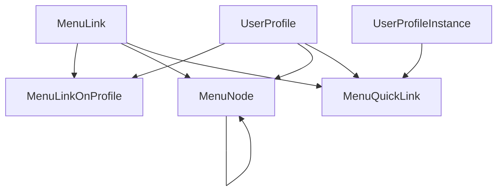

# GTA-1708 — Navigation catalog and trees in the backend

Treat **one numbered sub-step at a time** (B1, B2, … then F1, F2, …). Do not implement the whole ticket in a single prompt.

Conventions: [___back-plus.md](___back-plus.md) — LF only, no JSDoc, do not edit `src/lib/generated/**`. Nest CRUD from [cronexia-gta-back/__boilerplates/classname-kebab](../../cronexia-gta-back/__boilerplates/classname-kebab).

**Out of scope:** admin UI to edit menus (seeds are the editor). Recette `status` / `logins` stay off prod tables.

**Do not revert** partial work already on disk (listed below). Finish wiring; do not delete those files to “start clean”.

Related (already shipped, still the live MenuSecondary path until F4):

- [GTA-1708-backend---menu-secondary-shortcuts-defaults-and-by-users](GTA-1708-backend---menu-secondary-shortcuts-defaults-and-by-users) — `MenuQuickLink` with `code` + role defaults / UPI overload
- Front-v2: catalog + 262 loader + MenuSecondary from `page.data.menuQuickLinks`

---

## Already implemented (partial — do not revert)

Prisma schema files (B1) and seeds (B2–B5) are on disk and wired. **`bun prisma generate` was not run.** Nest still uses `MenuQuickLink.code`. Front-v2 catalog / `$links` unchanged.

---

### Backend conventions

@cronexia-suivi-2\suivi\___back-plus.md

---

### B1 — Prisma (schema on disk, client not regenerated) — **done except generate**

- [menu-link.prisma](../../cronexia-gta-back/app/prisma/schema/menu-link.prisma) — `name` unique, `label`, `href?`, `iconKey?`, `isButton`, `timeManagementModes` as optional **comma-separated String** (not a Prisma `String[]`)
- [menu-link-on-user-profile.prisma](../../cronexia-gta-back/app/prisma/schema/menu-link-on-user-profile.prisma) — `@@unique([menuLinkId, userProfileId])`
- [menu-node.prisma](../../cronexia-gta-back/app/prisma/schema/menu-node.prisma) — `MenuNodeKind` `FOLDER | LINK`, `parentId` self-relation
- [menu-quick-link.prisma](../../cronexia-gta-back/app/prisma/schema/menu-quick-link.prisma) — **`code` already dropped**, `menuLinkId` added
- [user-profile.prisma](../../cronexia-gta-back/app/prisma/schema/user-profile.prisma) — back-relations `menuLinkOnUserProfiles`, `menuNodes` (keeps `menuQuickLinks`)

**B1 leftover:** `bun prisma generate` (migrate on next reset). `UserProfileInstance` confirmed: no extra back-relation (`menuQuickLinks` already there).

### B2 — MenuLink seeds — **done**

- Helper [menu-link-name-from-label.ts](../../cronexia-gta-back/app/src/_utility/strings/menu-link-name-from-label.ts) (NFD, `removeSpecialChars`, spaces → `_`, lower)
- Catalog [menu-link-catalog.const.ts](../../cronexia-gta-back/app/prisma/seeds-new/01-required/menu-link/const/menu-link-catalog.const.ts) — explicit `name`s (`demandes_employee` / `demandes_manager`, widget extras, dev routes)
- [seed-menu-links.ts](../../cronexia-gta-back/app/prisma/seeds-new/01-required/menu-link/function/seed-menu-links.ts) + [menu-link.seed.ts](../../cronexia-gta-back/app/prisma/seeds-new/01-required/menu-link/menu-link.seed.ts)

**B2 leftover:** none. Catalog reviewed vs MenuSide / `page-links.svelte.ts` (hrefs covered; recette `status` / `logins` stay off). `seedMenuLinkCatalog` is called from `_required.orchestrator.ts` after `seedUserProfiles`.

### B3 — MenuLinkOnUserProfile seeds — **done**

- [menu-link-on-user-profile.seed.ts](../../cronexia-gta-back/app/prisma/seeds-new/01-required/menu-link-on-user-profile/menu-link-on-user-profile.seed.ts) — one row per catalog `profiles[]` (SUPER_ADMIN explicit)

**B3 leftover:** none. Orchestrator calls `seedMenuLinkOnUserProfiles(prisma, userProfiles, menuLinkIdByName)` after MenuLink.

### B4 — MenuNode seeds — **done**

- [menu-node-trees.const.ts](../../cronexia-gta-back/app/prisma/seeds-new/01-required/menu-node/const/menu-node-trees.const.ts)
- [seed-menu-nodes.ts](../../cronexia-gta-back/app/prisma/seeds-new/01-required/menu-node/function/seed-menu-nodes.ts)
- [menu-node.seed.ts](../../cronexia-gta-back/app/prisma/seeds-new/01-required/menu-node/menu-node.seed.ts) — EMPLOYEE / MANAGER / HR_MANAGER / ADMIN / SUPER_ADMIN

**B4 leftover:** none. Orchestrator calls `seedMenuNodes` after OnProfile. SUPER_ADMIN tree is a flat concat (EMPLOYEE + MANAGER + ADMIN + `DEV_TREE`); no “Collaborateur” / “Manager” wrappers.

### B5 — MenuQuickLink seeds — **done**

`MenuQuickLinkSeedRow` is `name` + `position`. [seed-menu-quick-links.ts](../../cronexia-gta-back/app/prisma/seeds-new/01-required/menu-quick-link/function/seed-menu-quick-links.ts) looks up `menuLinkId` by `name` (throws if missing). Defaults, [123456A.menu-quick-links.seed.ts](../../cronexia-gta-back/app/prisma/seeds-new/50-dev/resource/123456A.menu-quick-links.seed.ts), and 25-demo / 26-demo-arte `_bp` comments use catalog names.

Applied mapping:

- EMPLOYEE: `planning_team`, `calendrier`, `demandes_employee`, `mon_dossier`, `badger`
- MANAGER: `planning_collective`, `demandes_manager`, `absences`, `anomalies`
- HR: `planning_collective`, `dossiers`, `absences`, `compteurs`
- ADMIN / SA: `plannings_admin`, `employee_files` (href `/employee-file`, not `dossiers_admin`), `anomalies`, `pointages`, `compteurs_admin`
- Maxime: EMPLOYEE `calendrier` / `demandes_employee` / `droits` ; MANAGER `pointages` / `populations` / `compteurs`

### B6–B9 — Nest / GraphQL — **not started**

No `menu-links` / `menu-link-on-user-profiles` / `menu-nodes` modules. Existing [menu-quick-links](../../cronexia-gta-back/app/src/menu-quick-links) still has `code` (entity, DTOs, uniqueness, docs). After generate, Nest will not compile until B9.

---
---
---

### Frontend conventions

@cronexia-suivi-2\suivi\___front-plus.md

---

### F1–F6 — Frontend — **not started**

MenuSecondary still uses the TS catalog + `{ position, code }`. `$links` / `page-links.svelte.ts` / MenuSide `all-links.ts` unchanged.

---

## Decisions (locked)

- **Identifier is `name`, not `code`.** On `MenuLink` (and folder `MenuNode`s). `MenuQuickLink.code` is removed; the shortcut points at `MenuLink` (`menuLinkId`). GraphQL can still expose `menuLink.name`.
- **Same label, different href per role** = two `MenuLink` rows, e.g. label `Demandes` → `demandes_employee` vs `demandes_manager`. Display uses `label`.
- **`name` is derived from `label`** with existing string helpers (NFD / strip accents like `to-camel-case.ts`, `remove-special-chars.ts`), then spaces → underscores, lowercase. Helper `menuLinkNameFromLabel`. If that `name` already exists (same label, other href), append `_${profileCode.toLowerCase()}`. Seeds may set `name` explicitly (catalog already does).
- **`href` lives in DB** on `MenuLink`. Frontend `$links` / `page-links.svelte.ts` / `$links` alias in `svelte.config.js` go away after Front steps. Icons stay as **`iconKey`** (key of `iconsMenuSecondary`); assets stay on the front.
- **Recursive tree:** `MenuNode.parentId` self-relation, unlimited depth (Espace développeur → Integrations → leaf).
- **SUPER_ADMIN** does not wrap other roles. Duplicate `MenuNode` rows (and OnProfile) for SUPER_ADMIN in seeds. Dev tree is SUPER_ADMIN-only nodes, not a wrapper around EMPLOYEE/MANAGER files.
- Do **not** clone WorkflowTab / ResourceFieldTab (those are one global level).

`MenuLink` = page/action (name, label, href?, iconKey, isButton, timeManagementModes).
`MenuLinkOnProfile` = which roles may use that link.
`MenuNode` = where it appears for one role (folder or link, parent + position).
`MenuQuickLink` = ordered shortcuts for role default / UPI overload (unchanged ownership).

---

## Backend (remaining work)

### B1 leftover — generate — **done**

`bun prisma generate` in `cronexia-gta-back/app`. Tables appear on next `reset-bdd` / migrate. Do not revert schema files. After generate, Nest will not compile until B9 (`MenuQuickLink.code` still in the module). Reset can succeed now that B5 writes `menuLinkId`.

### B6 — Nest / GraphQL: MenuLink — **done**

Full CRUD (boilerplate). Create/createMany: if `name` omitted, `menuLinkNameFromLabel(label)` + suffix profile on collision. Model: `idMenuLink`, `name`, `label`, `href`, `iconKey`, `isButton`, `timeManagementModes` + nested relations as needed.

### B7 — Nest / GraphQL: MenuLinkOnUserProfile — **done**

Full CRUD + unique pair. Register next to MenuLink.

### B8 — Nest / GraphQL: MenuNode — **done**

Full CRUD. Service: uniqueness of `position` (and folder `name`) in `(userProfileId, parentId)` scope; `kind = LINK` requires `menuLinkId`; `kind = FOLDER` forbids `menuLinkId`. Query **flat** list `where: { userProfileId }` + `orderBy: { position: asc }`. Front builds the tree.

### B9 — Nest / GraphQL: MenuQuickLink adjust — **done**

Remove `code` from entity/DTOs/docs/uniqueness (`assert-menu-quick-link-scope-unique` → unique `menuLinkId` per scope). Connect `menuLink`. Overload vs defaults unchanged. UserProfile / UPI `menuQuickLinks` still filters defaults vs overload.

---

## Frontend

### F1 — Types + layout — **done**

`App.MenuLinkItem`, `App.MenuNodeItem` (flat: id, parentId, kind, label, iconKey, position, menuLink?). `Locals` + `+layout.server.ts`: `menuLinks`, `menuNodes`, keep `menuQuickLinks`. `depends('layout:menu-tree')` (and keep `layout:menu-quick-links`).

### F2 — GraphQL builders + loaders after auth — **done**

Same pattern as `262-load-menu-quick-links.ts`: `event.fetch(BACK_END_URL)`, not `/api/*`. After `userJustLoggedInSoGatherAuthDatas`:

- MenuLinks for `connectedUserProfileCode` (via OnProfile / whereOpen)
- MenuNodes for that profile
- MenuQuickLinks: nest `menuLink { name label href iconKey isButton timeManagementModes }`

Errors → `[]`, re-throw redirects. Hook in `navigation-cronexia.ts`.

### F3 — Resolve helpers — **done**

- `buildMenuTree(flatNodes)` → nested `{ label, icon, link, isButton, children }[]` (`iconKey` → `iconsMenuSecondary`)
- `hrefByMenuName(name)` from `page.data.menuLinks` / `locals`
- Shortcuts: `resolveMenuQuickLinks` reads **nested `menuLink`**, not the TS catalog. Unknown name: skip + `console.warn`. Keep `timeManagementModes`.

### F4 — MenuSecondary — **done**

`MenuSecondary.svelte`: visible links from loaded shortcuts + `menuLink`. Drop `catalog/`. svelte-autofixer. Burger / clocking button stay (`isButton` → `clockingPresenceState`).

### F5 — MenuSide — **done**

`MenuSide.svelte`: `items` from `buildMenuTree(page.data.menuNodes)`. Drop `allMenuLinks` / `hasProfile` on this tree. Keep `timeManagementModes`. Recursive flyouts already exist.

### F6 — Remove `$links` — **done**

Grep `from '$links'` (widgets, Home*, vacation-rights `+page.server.ts`, AI url-builder, declaration-presence, …). Replace with `hrefByMenuName` / `page.data` / `locals`. Then delete `page-links.svelte.ts` and the `$links` alias in `svelte.config.js`. Delete `employee.ts`, `manager.ts`, `hr-manager.ts`, `admin.ts`, `dev.ts`, `all-links.ts`. Grep-clean.

---

## Suggested prompt split

1. **B1 leftover — generate** — `bun prisma generate` in `cronexia-gta-back/app`. Do not revert schema / seeds. Nest compile stays broken until B9.
2. **B6** MenuLink Nest
3. **B7** MenuLinkOnUserProfile Nest
4. **B8** MenuNode Nest
5. **B9** MenuQuickLink Nest adjust
6. **F1** types + layout
7. **F2** loaders
8. **F3** helpers
9. **F4** MenuSecondary
10. **F5** MenuSide
11. **F6** drop `$links` + hardcoded trees

---

## Recette (after F6)

- Each role MenuSide matches today’s trees (no SUPER_ADMIN wrapper folders; SA sees duplicated entries + Espace développeur nested Integrations).
- MenuSecondary role defaults match current default names / hrefs.
- Maxime EMPLOYEE/MANAGER overloads show any seeded link for that profile (including former MenuSide-only pages).
- Badger hidden unless time-management mode matches.
- Profile switch (`invalidateAll`) reloads tree + shortcuts + href map.
- Empty/error load: empty menus, no hardcoded fallback.
- Widget / in-page links still work with no `$links` import.
