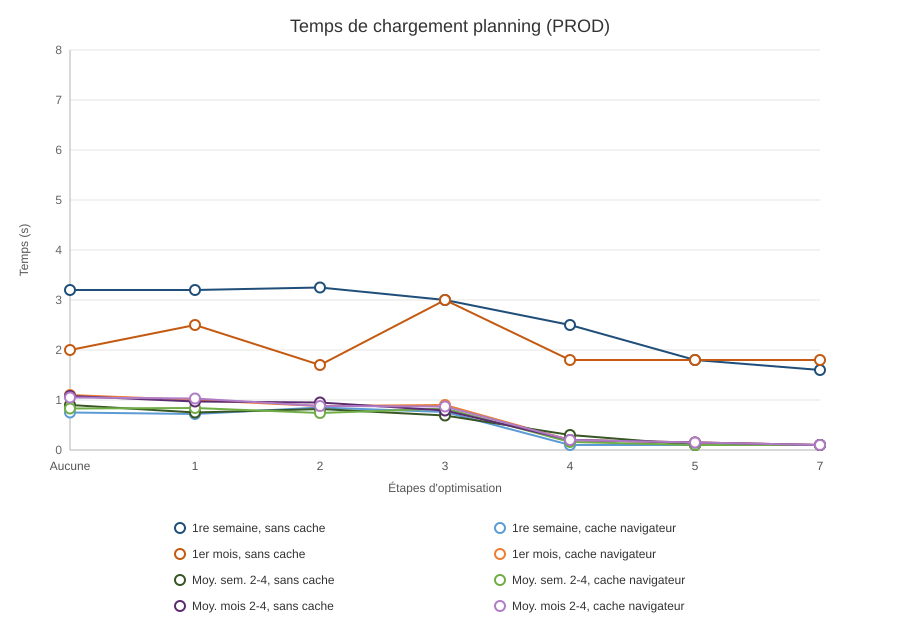

# Benchmarks

⏱️ Faire les benchs en dev & prod afin de comparer les gains

## ⏱️✨ Benchmarks de base

- DEV/WATCH back & front > super.admin planning > seeds dev toutes pop toutes resources sur avril 2024
  - sans cache navigateur
    - Semaines
      - Première semaine 7,5 sec
      - 2eme semaine 750ms
      - 3eme semaine 750ms
      - 4eme semaine 600ms
    - Mois
      - Premier mois 7,5 sec
      - 2eme mois 1 sec
      - 3eme mois 1,1 sec
      - 4eme mois 1,2 sec
  - //
  - avec cache navigateur
    - Semaines
      - Première semaine 850ms
      - 2eme semaine 750ms
      - 3eme semaine 650ms
      - 4eme semaine 725ms
    - Mois
      - Premier mois 850ms
      - 2eme mois 1,1 sec
      - 3eme mois 900ms
      - 4eme mois 1 sec
  - //
  - //
  - //
  - PROD back & front > super.admin planning > seeds dev toutes pop toutes resources sur avril 2024
    - sans cache navigateur
      - Semaines
        - Première semaine 3,2s
        - 2eme semaine 950ms
        - 3eme semaine 900ms
        - 4eme semaine 850ms
      - Mois
        - Premier mois ~2s
        - 2eme mois 950ms
        - 3eme mois 1,1s
        - 4eme mois 1,2s
    - //
    - avec cache navigateur
      - Semaines
        - Première semaine 750ms
        - 2eme semaine 700ms
        - 3eme semaine 900ms
        - 4eme semaine 900ms
      - Mois
        - Premier mois 1,1s
        - 2eme mois 900ms
        - 3eme mois 1,1s
        - 4eme mois 1,15s

---

🚨🐌 PROD uniquement, ça prend une plombes

---

## 1. Parallelize independent fetches in `getResourcesPlanningDatas`

- PROD back & front > super.admin planning > seeds dev toutes pop toutes resources sur avril 2024
  - sans cache navigateur
    - Semaines
      - Première semaine 3,2s
      - 2eme semaine 720ms
      - 3eme semaine 750ms
      - 4eme semaine 770ms
    - Mois
      - Premier mois 2,5s
      - 2eme mois 1s
      - 3eme mois 900ms
      - 4eme mois 1s
  - //
  - avec cache navigateur
    - Semaines
      - Première semaine 720ms
      - 2eme semaine 900ms
      - 3eme semaine 850ms
      - 4eme semaine 770ms
    - Mois
      - Premier mois 1s
      - 2eme mois 1s
      - 3eme mois 1s
      - 4eme mois 1,1s

---

## 2. Return counters after the grid (async, with a placeholder)

- PROD back & front > super.admin planning > seeds dev toutes pop toutes resources sur avril 2024
  - sans cache navigateur
    - Semaines
      - Première semaine entre 3 & 3,5s
      - 2eme semaine 920ms
      - 3eme semaine 750ms
      - 4eme semaine 780ms
    - Mois
      - Premier mois 1,7s
      - 2eme mois 920ms
      - 3eme mois 960ms
      - 4eme mois 980ms
  - //
  - avec cache navigateur
    - Semaines
      - Première semaine 850ms
      - 2eme semaine 820ms
      - 3eme semaine 660ms
      - 4eme semaine 750ms
    - Mois
      - Premier mois 880ms
      - 2eme mois 830ms
      - 3eme mois 820ms
      - 4eme mois 1s

---

## 3. Paginate or virtualize resources when the population is large

- PROD back & front > super.admin planning > seeds dev toutes pop toutes resources sur avril 2024
  - sans cache navigateur
    - Semaines
      - Première semaine 3s
      - 2eme semaine 780ms
      - 3eme semaine 650ms
      - 4eme semaine 650ms
    - Mois
      - Premier mois 3s
      - 2eme mois 700ms
      - 3eme mois 770ms
      - 4eme mois 900ms
  - //
  - avec cache navigateur
    - Semaines
      - Première semaine 760ms
      - 2eme semaine 810ms
      - 3eme semaine 900ms
      - 4eme semaine 770ms
    - Mois
      - Premier mois 900ms
      - 2eme mois 810ms
      - 3eme mois 900ms
      - 4eme mois 910ms

---

## 4. Prefetch the previous and next period once the page is loaded

- PROD back & front > super.admin planning > seeds dev toutes pop toutes resources sur avril 2024
  - sans cache navigateur
    - Semaines
      - Première semaine ~2,5s
      - 2eme semaine 350ms !
      - 3eme semaine 300ms
      - 4eme semaine 260ms
    - Mois
      - Premier mois ~1,8s
      - 2eme mois 200ms
      - 3eme mois 200ms
      - 4eme mois 200ms
  - //
  - avec cache navigateur
    - Semaines
      - Première semaine < 100ms
      - 2eme semaine 150ms
      - 3eme semaine 180ms
      - 4eme semaine 150ms
      - // Ressentit instant
    - Mois
      - Premier mois 200ms
      - 2eme mois 200ms
      - 3eme mois 200ms
      - 4eme mois 200ms

---

## 5. Start the planning query without waiting on the catalogues, and fetch workflow once

- PROD back & front > super.admin planning > seeds dev toutes pop toutes resources sur avril 2024
  - sans cache navigateur
    - Semaines
      - Première semaine ~1,8s
      - 2eme semaine < 100ms
      - 3eme semaine < 100ms
      - 4eme semaine < 100ms
    - Mois
      - Premier mois ~1,8s
      - 2eme mois < 150ms
      - 3eme mois < 150ms
      - 4eme mois < 150ms
  - //
  - avec cache navigateur
    - Semaines
      - Première semaine < 100ms
      - 2eme semaine < 100ms
      - 3eme semaine < 100ms
      - 4eme semaine < 100ms
    - Mois
      - Premier mois < 150ms
      - 2eme mois < 150ms
      - 3eme mois < 150ms
      - 4eme mois < 150ms

---

## 6. Stop refetching catalogues on every period change

- skipped

---

## 7. Replace the full-payload `JSON.stringify` guard

- PROD back & front > super.admin planning > seeds dev toutes pop toutes resources sur avril 2024
  - sans cache navigateur
    - Semaines
      - Première semaine 1,6s
      - 2eme semaine < 100ms
      - 3eme semaine < 100ms
      - 4eme semaine < 100ms
    - Mois
      - Premier mois 1,8s
      - 2eme mois < 100ms
      - 3eme mois < 100ms
      - 4eme mois < 100ms
  - //
  - avec cache navigateur
    - Semaines
      - Première semaine < 100ms
      - 2eme semaine < 100ms
      - 3eme semaine < 100ms
      - 4eme semaine < 100ms
    - Mois
      - Premier mois < 100ms
      - 2eme mois < 100ms
      - 3eme mois < 100ms
      - 4eme mois < 100ms

---

## Graphical display

Baseline = mesures PROD de « Benchmarks de base ». L'etape 6 (skipped) n'apparait pas.

Encodage des valeurs :
- moyennes = moyenne des periodes 2, 3 et 4 uniquement
- `~` trace au chiffre indique (premier mois baseline 2,0 s ; etape 4 premiere semaine 2,5 s et premier mois 1,8 s ; etape 5 premiere semaine et premier mois 1,8 s)
- etape 2 premiere semaine « entre 3 & 3,5 s » tracee au milieu 3,25 s
- `< 100 ms` trace a 0,10 s et `< 150 ms` a 0,15 s (plafonds). Une moyenne faite seulement de ces plafonds reste un plafond (etapes 5 et 7).
- a partir de l'etape 5, plusieurs courbes cache se superposent sur le meme plafond
