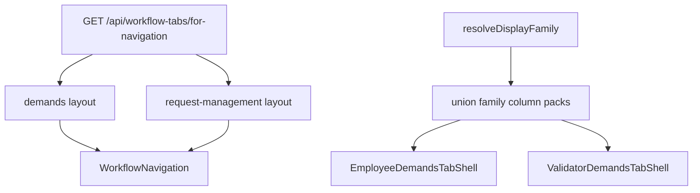

# 🎨 Front / 🌊✔️Workflows / 🔧 Onglets / 🎨🌐 Page de base & renderer familles

> **Implemented (2026-09).** Phases A / B / C done. Nav + tables + create consume `workflowTabsForNavigation`. URLs use catalog `name` (`scheduleChange`, …). Synthetic tabs: collab `summary`, validator `my-requests`. STO is unassigned pool (no UI). Clockings is `affected: false`. §1 below is **AS-WAS** at ticket open — not current architecture.

## Workflows references

workflow notes@cronexia-suivi-2/suivi/________________workflow-context.md
---
already done : backend @cronexia-suivi-2/suivi/__workflows-tabs---1---GTA-1624.md @cronexia-suivi-2/suivi/__workflows-tabs---2---GTA-1625.md @cronexia-suivi-2/suivi/__workflows-tabs---3---GTA-1628.md @cronexia-suivi-2/suivi/__workflows-tabs---4---GTA-1629.md
---
Frontend has hard coded tabs for both employees @cronexia-gta-front-v2/app/src/routes/(app)/(without-filters)/demands  and validators @cronexia-gta-front-v2/app/src/routes/(app)/(with-filters)/request-management
---
Here are my french notes with implementations recommandations and interrogations (that must be resolved before processing)
---
create detailed plan in @cronexia-suivi-2/suivi/__workflows-tabs-frontend---10---GTA-1631.md , with question & answer (i can answer questions or pinpoint file location or dev choices if needed) . plan must be splitted into mangeable, prioritized steps

---
---
---

GTA-1631 — remplacer les onglets hardcodés `/demands` (collab) et `/request-management` (valideurs) par `workflowTabsForNavigation` + assemblage des colonnes par **union de familles**.

Backend déjà livré : GTA-1624 (schéma), GTA-1625 (seeds), GTA-1628 (nav), GTA-1629 (pool unaffecteds).

Références :

- Contexte : [________________workflow-context.md](________________workflow-context.md)
- Notes 17/09 : [09-septembre/260917-suivi.md](09-septembre/260917-suivi.md)
- Query déjà branchée : `cronexia-gta-front-v2/app/src/lib/graphql/workflow-tab/queries/workflowTabsForNavigation.ts`
- API : `cronexia-gta-front-v2/app/src/routes/api/workflow-tabs/for-navigation/+server.ts`
- Hardcode actuel : `cronexia-gta-front-v2/app/src/routes/functions/cronexia/workflow/employee-demands-tabs.ts`

Hors périmètre (détail Q10) : page admin **organize** des onglets ; **page / UI déclaration en heures**. STO TT : pas d’UI (Q13). Ne pas changer les gathers Nest WR.

---

## 1. Fichiers & rôles (AS-WAS — ticket open)

### Collab — `/demands` (already `[tab]`)

- Layout : `routes/(app)/(without-filters)/demands/+layout.svelte` + `+layout.server.ts` (fetch **all** WR, puis filtre client)
- Contenu : `EmployeeDemandsTabContent.svelte` → `EmployeeDemandsTabShell.svelte`
- Création : `WorkflowNewDemandButton.svelte` + `TARGET_BY_TAB` hardcodé

### Valideurs — `/request-management` (dossiers physiques)

- Layout : `+layout.svelte` + `+layout.server.ts` (badges `buildWorkflowToValidateSummary`)
- Contenu : `ValidatorDemandsTabContent.svelte` → `ValidatorDemandsTabShell.svelte`
- Loaders : un `workflowNames` hardcodé par dossier (`absences`, `schedule-change`, `remote-work-event`, `days-declaration`)
- Routes spéciales à garder : `my-requests/` (synthèse), `declaration-view/` (pas un onglet)
- Route orpheline **à supprimer** : `remote-work-schedule-overload/` (STO TT hardcodé / caché)

### Déjà partagé (on garde)

`WorkflowNavigation.svelte`, `WorkflowDemandsTable.svelte`, toolbar / filtres / accordéon. Les **Shells** restent séparés (actions collab ≠ valider/refuser).

### Seeds actuelles (source de vérité nav)

Affected : `scheduleChange` Horaires, `remoteWorkByEvent` Télétravail, `absences` Absences (CP+RTT only), `daysDeclaration` Déclaratifs en jours.

Unaffected (pas dans la nav) : `clockings` (vide), `congeMariage`, `enfantMalade`, `hoursDeclaration`.

À ajuster en seed : aujourd’hui STO (`WORKFLOW_SCHEDULE_OVERLOAD_TT`) est collé à l’onglet unaffectéd `remote-work-by-schedule`. **Cible :** plus d’onglet `remoteWorkBySchedule` ; join pool `workflowTabId = null` (unassigned). Le template WF reste.

---

## 2. Questions & réponses

### Q1 — Segment d'URL : `code` ou `name` ?

**Décidé : `name`.**

`code` = saisie admin brute (accents, espaces, spéciaux) — **on ne le mute pas**. `name` est déjà le champ calculé unique : `toCamelCase(removeSpecialChars(code))` via `workflowTabNameFromCode` (ex. `schedule-change` → `scheduleChange`). Collision `name` refusée par Prisma `@unique`. **Pas de 3e champ Prisma / slug.**

URLs :

- Collab : `/demands/scheduleChange/dateStart/…`
- Valideur : `/request-management/scheduleChange/population/…`

Cookie `WORKFLOW__CURRENT_TAB` stocke `name`.

Redirects legacy (kebab / anciens FR) → `name` :

| Ancien | Nouveau |
| --- | --- |
| `schedule-change` | `scheduleChange` |
| `remote-work-by-event`, `remote-work-event` | `remoteWorkByEvent` |
| `days-declaration`, `declaration-jours` | `daysDeclaration` |
| `conges-payes` | `absences` |
| `pointages` | `clockings` |
| `my-requests` | synthèse collab `summary` (alias valideur inchangé) |

Inconnu / stale cookie → synthèse (`summary` / `my-requests`).

**Noms réservés** (ne pas laisser un onglet DB les prendre) : `summary`, `my-requests`, `declaration-view`. Si un admin crée `name=summary`, collision avec l'onglet synthétique — follow-up back minime (reject), sinon le front ignore le doublon DB.

`name` n'est régénéré au **create** que si omis. Un update de `code` **ne régénère pas** `name` aujourd'hui (écart GTA-1624). Hors ticket, à noter : URLs cassées si on change `code` sans `name`.

### Q2 — Seeds vs GTA-1625 ?

**Décidé : suivre la DB actuelle.** Retirer les artefacts hardcodés (listes d'onglets, `ABSENCE_EVENT_WORKFLOW_NAMES` comme filtre d'onglet, buckets de badges, `columnsByTab` indexé sur l'union `WorkflowTab`).

Conséquence : Pointages / CMAR / ENFM **disparaissent de la nav** tant que leurs onglets restent `affected: false`. En Synthèse (B3) : seulement les WR dont le WF est sur ≥1 onglet **affected** — donc CMAR/ENFM/STO n’y figurent pas non plus tant qu’ils ne sont pas affectés.

### Q3 — Merger collab + valideur ?

**Décidé : hybride.** Pas un mega-composant `mode=employee|validator`. Parents contextuels séparés (Content + Shell). Familles de colonnes / `displayFamily` / table générique partagés. `await import` surtout pour les **modales de création**, pas pour les packs de colonnes (besoin du union sur un onglet mixte).

### Q4 — Dossiers valideur vs `[tab]` ?

**Décidé : migrer vers `[tab]`** comme le collab. Garder `my-requests/` et `declaration-view/`. Redirect des anciens dossiers kebab.

### Q13 — Deux télétravails : Event vs surcharge d’horaire (STO)

Le TT peut exister de **2** façons :

- `eventRangeOnResource` + Event `isRemoteWork` — c’est l’onglet Télétravail seedé (`remoteWorkByEvent`). **UI livrée, on garde.**
- `remoteWorkByScheduleTypeOverload` / `WORKFLOW_SCHEDULE_OVERLOAD_TT` — développé, **caché en dur** (`/request-management/remote-work-schedule-overload` + `resolveValidatorSegmentForWorkflow` qui force ce segment). **Plus d’UI.**

**Décidé :**

1. **Front — retirer** l’arbre `remote-work-schedule-overload/`, le mapping STO → cet URL, et tout hardcode « hidden tab » STO. Anciens bookmarks → redirect synthèse (`my-requests` / `summary`), pas vers Télétravail Event.
2. **Seeds — garder le workflow**, le **détacher de tout onglet** : `WorkflowOnWorkflowTab.workflowTabId = null` (pool GTA-1629). **Supprimer** l’onglet unaffectéd `remote-work-by-schedule` (plus de raison d’exister).
3. **Pas d’affichage front** : comme il n’est sur aucun onglet `affected`, il n’apparaît ni en barre ni en table famille. La Synthèse ne liste que les WR dont le workflow est sur **au moins un onglet affected** (sinon le pool reviendrait en Synthèse).
4. Pas de pack colonnes / create modal `remoteWorkSto` en v1. Discriminateur `displayFamily` peut encore le reconnaître en `generic` si une ligne orpheline passe, mais le filtre membership l’exclut.

Réactive plus tard = assigner le WF à un onglet (organize, ticket dédié), sans recâbler une route fantôme.

### Q5 — Colonnes d'un onglet mixte ?

**Décidé : union des packs famille.** Cellules vides si la ligne n'utilise pas la colonne. Préfixe valideur : matricule, nom, prénom. Suffixe : date d'envoi, état, PJ si besoin. Colonne **Type** si plus d'une famille sur l'onglet.

### Q6 — `workflow.isActive` ?

Masquer des **listes de création**. Afficher les WR existants si le gather les renvoie. L'onglet s'affiche dès qu'il est `affected` (même si tous les WF sont inactifs).

### Q7 — Visibilité Pointages collab ?

Plus de `showClockingsTab` hardcodé sur une clé d'onglet. Règle **par famille** : si l'onglet ne contient que du `clockingOverload` (ou au moins un, TBD à l'implémentation : cacher l'onglet entier si l'utilisateur n'est pas en pointages réels). Aujourd'hui l'onglet est unaffectéd donc invisible. Valideur : afficher si `affected`, plus `showClockingsTab={false}`.

### Q8 — Bouton / popup création ?

In scope collab. Liste = workflows de l'onglet ∩ `isActive` ∩ droit ∩ modale existante. 0 → hide ; 1 famille → ouvrir la modale ; plusieurs → choice filtrée. Pas de modale `declarationHours`. STO n’est plus créable (pas sur un onglet). Synthèse = choice filtrée aux WF présents sur **un onglet affected**.

### Q9 — Filtre gather valideur ?

Garder `workflowNames` dérivé des `workflow.name` de l'onglet courant. Synthèse : pas de filtre noms. Collab : fetch layout unique + filtre membership. Pas de changement Nest gather.

### Q10 — Hors périmètre explicite (organize + déclaration heures)

**Décidé : hors GTA-1631.** Ne pas implémenter.

1. **Organize admin (UI)** — page drag-and-drop pour créer / réordonner les onglets et y déposer des workflows (patron resource-field organize, ex. `/admin/fields/organize`). Le back existe déjà (`workflowTabsForNavigation(includeUnaffectedTabs: true)`, `workflowsNotAffectedToTabs`). Ce ticket **consomme** seulement les onglets `affected: true` sur `/demands` et `/request-management`. Pas d’écran admin, pas de DnD, pas de CRUD onglets côté front.

2. **Déclaration en heures (UI / page)** — template `WORKFLOW_DECLARATION_HOURLY` / type `declarationHours`. Pas de table collab/valideur, pas de modale de création, pas de pack colonnes dédié. Seuls les **déclaratifs en jours** (`daysDeclaration`) sont dans le renderer. Le workflow heures reste en seed (onglet unaffectéd ou pool) ; il n’apparaît pas tant qu’il n’est pas `affected` + UI dédiée (ticket ultérieur).

STO : **dans** ce ticket uniquement comme **retrait** de la route cachée + seed pool (Q13), pas comme feature à livrer.

### Q11 — `iconKey` ?

Resolver type `iconFromMenuKey` : `iconsWorkflows` puis `icons`. Inconnu → warn. Fallback Prisma : première famille des workflows assignés, sinon `icons.list`.

### Q12 — `displayFamily` ?

Primaire = `workflow.type` puis flags Event si `eventRangeOnResource` (`isRemoteWork` → TT event, sinon absence ; `targetEvent` null → `generic`). `isOnCallDuty` / `isTravelling` → pack absence pour l'instant. Helpers de **noms** seulement en fallback sur une ligne WR sans Event cible.

Packs v1 : `absenceEvent`, `remoteWorkEvent`, `scheduleChange`, `clockingOverload`, `declarationDays`. `declarationHours` / `generic` → Type + période. Pas de pack `remoteWorkSto`.

---

## 3. Architecture

Onglet synthétique **hors DB**, toujours en premier : collab `summary`, valideur `my-requests`.

---

## 4. Plan priorisé (un step = un prompt)

Ordre : **A extraire / refactorer** (écrans identiques) → **B remplacer le hardcode** (une surface à la fois) → **C nettoyer**.

Ne pas câbler l’API ni changer les URLs tant que A n’est pas vert. Un step = un diff reviewable. Les Shells (`EmployeeDemandsTabShell` / `ValidatorDemandsTabShell`) ne se fusionnent pas.

Si on coupe le ticket : premier merge = **A1–A4 + B1–B3**. Second PR = B4–B7 + C.

Fichiers cibles récurrents : `EmployeeDemandsTabContent.svelte`, `ValidatorDemandsTabContent.svelte`, `employee-demands-tabs.ts`, nouveau dossier `routes/functions/cronexia/workflow-tab/`.

---

### Phase A — Création / refactor composants (hardcode inchangé) - ✅ **DONE**

Les pages collab + valideur restent branchées sur `workflowEmployeeTabs` / `WorkflowTab`. On sort les morceaux pour le renderer familles.

**A1 — `resolveDisplayFamily`** - ✅ **DONE**

- Helper unique : `workflow.type` puis flags Event (`isRemoteWork`, …), fallback nom.
- Brancher l’accordéon (`build-workflow-demand-details.ts`) dessus.
- Pas de fetch nav, pas de changement de colonnes.

**A2 — Packs famille côté collab** - ✅ **DONE**

- Extraire `columnsByTab` / `rowsByTab` / `searchKeysByTab` de `EmployeeDemandsTabContent.svelte` vers `workflow-tab/families/*.family.ts` (`absenceEvent`, `remoteWorkEvent`, `scheduleChange`, `clockingOverload`, `declarationDays`).
- Chaque pack : `mapEmployeeRow`, `familyColumns`, `searchKeys`.
- Le Content **switch encore** sur `WorkflowTab` hardcodé.

**A3 — Packs famille côté valideur + cellules** - ✅ **DONE**

- Même extract depuis `ValidatorDemandsTabContent.svelte` (`mapValidatorRow`).
- `WorkflowFamilyCells.svelte` : snippets horaire / alerte (pas de snippets dans du `.ts`).
- Shells inchangés. Écrans identiques.

**A4 — `buildTabTableSpec` (union)** - ✅ **DONE**

- Compose identity (valideur) + packs + Type si plusieurs familles + suffixe envoi / état / PJ.
- Alimenté par un **shim** `hardcoded tab → families[]` (pas encore le payload DB).
- Permet un onglet mixte plus tard sans retoucher les Contents.

**A5 — Modales création (optionnel, perf)** - ✅ **DONE**

- `import()` conditionnel dans `WorkflowNewDemandButton.svelte`.
- Cible toujours `TARGET_BY_TAB`. Pas de filtre par onglet DB.

**Checkpoint A :** Patrick / Murielle / Pierre-Olivier = **même UI qu’avant**.

---

### Phase B — Remplacement hardcode → dynamique (priorité recette) - ✅ **DONE**

**B1 (prio 1) — Catalog mort (data only)** - ✅ **DONE**

- Parse `workflowTabsForNavigation` : `name`, `code`, `label`, `position`, `iconKey`, workflows imbriqués.
- `iconFromWorkflowTabKey`. Prepend synthèse (`summary` / `my-requests`).
- Fetch dans les deux `+layout.server.ts`. Soft fail : toast, pas de crash.
- **UI pas encore branchée.**

**B2 (prio 1) — Barre d’onglets = premier win visible** - ✅ **DONE**

- `WorkflowNavigation` depuis le catalog (`label`, icône, ordre, hrefs sur `name` ou encore kebab le temps de B5 — rester cohérent avec les routes existantes jusqu’à B5).
- Badges valideur : `buildWorkflowToValidateSummary` par membership (WF ∈ onglet affected). `total` = pending dont le WF est sur ≥1 onglet affected.
- Titre : `label` DB.
- Checkpoint : barre = seeds affected (plus Pointages / CMAR / ENFM en nav). Tables encore hardcodées.

**B3 (prio 2) — Tables collab dynamiques** - ✅ **DONE**

- Filtre lignes par membership (id / `workflow.name` de l’onglet).
- Synthèse = WR dont le WF est sur ≥1 onglet affected (exclut le pool STO).
- Load déclaratifs si l’union contient `declarationDays` (plus de special-case `days-declaration`).
- `buildTabTableSpec` alimenté par les familles du catalog, plus le shim A4.

**B4 (prio 2) — Create collab depuis l’onglet** - ✅ **DONE**

- Drop `TARGET_BY_TAB`. Liste = WF de l’onglet ∩ `isActive` ∩ droits ∩ modale existante.
- 0 hide / 1 modale / plusieurs choice filtrée. Synthèse = WF de tout onglet affected.

**B5 (prio 3) — URLs `name` + redirects kebab (collab d’abord)** - ✅ **DONE**

- `[tab]` = `scheduleChange`, etc. Cookie = `name`.
- Map legacy (Q1). Inconnu → `summary`.
- Ne pas fusionner avec B6.

**B6 (prio 3) — Valideur `[tab]` (gros, isolé)** - ✅ **DONE**

- `loadValidatorTabPage` : `workflowNames` depuis le catalog.
- Arbre `request-management/[tab]/…`. Redirect dossiers kebab. Garder `my-requests` + `declaration-view`.
- `ValidatorDemandsTabContent` = spec B3. Shell inchangé.
- Ne pas y coller le STO.

**B7 (prio 4) — STO isolé** - ✅ **DONE**

- Seed : `WORKFLOW_SCHEDULE_OVERLOAD_TT` → `workflowTabId: null` ; drop onglet `remote-work-by-schedule`.
- **Supprimer** `remote-work-schedule-overload/` ; redirect `my-requests` / `summary` (pas Télétravail Event).
- Retirer `resolveValidatorSegmentForWorkflow` STO.

**Checkpoint B2 :** nav OK. **B3 :** collab OK. **B6 :** valideurs OK.

---

### Phase C — Cleanup - ✅ **DONE**

**C1 — Dead code tabs** - ✅ **DONE**

- `employee-demands-tabs.ts` : plus que redirects + hrefs. Plus d’union TS `WorkflowTab`, plus de `workflowEmployeeTabs` comme source de vérité.

**C2 — Deep-links / droits** - ✅ **DONE**

- Cible = premier onglet **affected** qui contient le WF. Plus `resolveWorkflowDemandTab(type)`. STO = pas de cible (synthèse).

**C3 — Pointages par famille** - ✅ **DONE**

- Plus de `showClockingsTab` sur une clé d’onglet. Cacher si famille `clockingOverload` et collab pas en pointages réels. Valideur : afficher ssi `affected`.

**C4 — Smoke** - ✅ **DONE**

- Patrick, Murielle, Pierre-Olivier.
- Tab inconnu, onglet vide, WF inactif, PJ, bookmark STO, URLs kebab.

---

## 5. Hors périmètre (checklist)

- Page admin organize des WorkflowTab (DnD, unaffecteds, CRUD onglets).
- Page / modale / colonnes **déclaration en heures** (`declarationHours`).
- Réactiver l’UI STO TT (assigner à un onglet = ticket ultérieur).
- Modifier `resourcesGetWorkflowResource` / `userProfileInstanceGetWorkflowResource`.
- 3e champ Prisma slug ; muter `code` stocké ; régénérer `name` au update de `code`.
- JSDoc, fichiers GraphQL générés, conversion CRLF.

---

## 6. Conventions

LF, pas de JSDoc, banners d'imports workspace, Svelte 5 runes. Ne pas toucher `$lib/generated/**`. Recette hors Cursor (watch mode).
