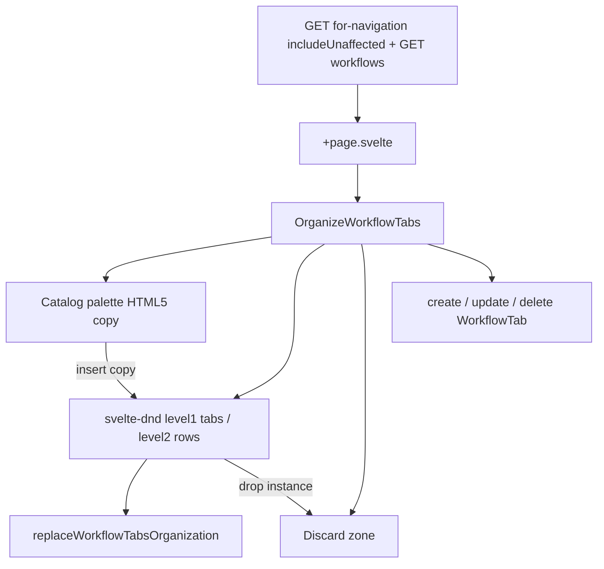

# 🎨 Front / 🌊✔️Workflows / 🔧 Onglets / 🛠️🌐 Admin organize

> **À implémenter.** Page admin CRUD + assignation / réordre des familles d’onglets (`WorkflowTab`). Hors GTA-1631 (Q10). Backend gathers déjà là (GTA-1628 / GTA-1629) ; **il manque** la mutation bulk replace (wipe + recreate).

## Workflows references

workflow notes@cronexia-suivi-2/suivi/________________workflow-context.md
---
already done : backend @cronexia-suivi-2/suivi/__workflows-tabs---1---GTA-1624.md @cronexia-suivi-2/suivi/__workflows-tabs---2---GTA-1625.md @cronexia-suivi-2/suivi/__workflows-tabs---3---GTA-1628.md @cronexia-suivi-2/suivi/__workflows-tabs---4---GTA-1629.md
---
already done : frontend nav / tables @cronexia-suivi-2/suivi/__workflows-tabs-frontend---10---GTA-1631.md
---
Références UI (ne pas forker tel quel) :

- Menu quick links (save **replace**, code propre) @cronexia-gta-front-v2/app/src/routes/(app)/(without-filters)/admin/menus/quick-links-defaults
- Resource fields organize (CRUD onglets + 2 colonnes affected / unaffecteds) @cronexia-gta-front-v2/app/src/routes/(app)/(without-filters)/admin/fields/organize
- Palette copy-drag (source reste en place) @cronexia-gta-front-v2/app/src/routes/components/cronexia/collective-schedule/palette
---
Cible front : @cronexia-gta-front-v2/app/src/routes/(app)/(without-filters)/admin/workflow/organize
---
Menu : Admin > Workflows > Organiser
- seeds @cronexia-gta-back/app/prisma/seeds-new/01-required/menu-link/const/menu-link-catalog.const.ts
- titre @cronexia-gta-front-v2/app/src/config/page-config.ts

---
---
---

Page admin pour **créer / modifier / supprimer** les familles d’onglets (`WorkflowTab`) et **assigner / réordonner** les workflows dessus.

Gathers déjà livrés :

- `workflowTabsForNavigation(includeUnaffectedTabs: true)` — onglets ± non affectés + joins
- `workflowsNotAffectedToTabs` — pool `workflowTabId = null` (dérivé au save, pas une colonne source)

Hors périmètre : CRUD des **templates** Workflow ; UI déclaration heures ; UI STO (assigner STO à un onglet suffit plus tard).

---

## 1. Fichiers & rôles (AS-WAS)

### Backend déjà là

- Schéma : `cronexia-gta-back/app/prisma/schema/workflow-tab.prisma`, `workflow-on-workflow-tab.prisma`
- CRUD unitaire : `createWorkflowTab` / `updateWorkflowTab` / `deleteWorkflowTab` + mêmes ops sur `WorkflowOnWorkflowTab`
- Nav : `workflowTabsForNavigation` — défaut `affected: true` ; admin `includeUnaffectedTabs: true`
- Pool : `workflowsNotAffectedToTabs`
- Front GraphQL / API : `lib/graphql/workflow-tab/*`, `lib/graphql/workflow-on-workflow-tab/*`, `/api/workflow-tabs/for-navigation`, `/api/workflow-tab/create|update|delete`, `/api/workflow/not-affected-to-tabs`, `/api/workflows`

### Manquant

- Mutation bulk **replace** (wipe tabs + joins, recreate, pool dérivé)
- Delete tab : FK restrict si des joins existent — il faut d’abord les retirer / pooler
- Page `/admin/workflow/organize`
- Entrée menu + `page-config`

### Seeds (source de vérité actuelle)

**Affected (`affected: true`) — barre `/demands` + `/request-management`**

| pos | code | name | label | workflows |
| --- | --- | --- | --- | --- |
| 1 | `schedule-change` | `scheduleChange` | Horaires | scheduleOverload |
| 2 | `remote-work-by-event` | `remoteWorkByEvent` | Télétravail | TT + TT without validators |
| 3 | `absences` | `absences` | Absences | CP + RTT |
| 4 | `days-declaration` | `daysDeclaration` | Déclaratifs en jours | declarationDays |

**Unaffected (`affected: false`) — zone admin**

| pos | code | name | label | workflows |
| --- | --- | --- | --- | --- |
| 1 | `clockings` | `clockings` | Pointages | aucun (onglet vide) |
| 2 | `conge-mariage` | `congeMariage` | Congé mariage | CMAR |
| 3 | `enfant-malade` | `enfantMalade` | Enfant malade | ENFM deferred |
| 4 | `hours-declaration` | `hoursDeclaration` | Déclaration en heures | declarationHours |

**Pool (`workflowTabId: null`)** : `WORKFLOW_SCHEDULE_OVERLOAD_TT` (STO) uniquement.

Synthèse (`summary` / `my-requests`) **n’est jamais une ligne DB**.

---

## 2. Questions & réponses

### Q1 — Save : incremental CRUD vs bulk replace ?

**Décidé : bulk replace**, calqué sur `replaceMenuQuickLinksForScope` (DTO typé, `$transaction`, `deleteMany` + `createMany`, asserts d’unicité).

**Pas** `resourceFieldTab_ReorderAllTabsAndFields` (vieux, `console.log`, enveloppes Prisma nested). RF reorder = **OOS comme référence save**.

Invariant GTA-1624 : un workflow sur ≥1 onglet n’a **pas** de ligne pool ; le wipe + recreate maintient ça. Pool **dérivé** au save : tout `Workflow` absent des tabs → une row `workflowTabId: null`.

Payload :

```ts
{
  tabs: Array<{
    code: string
    label: string
    affected: boolean
    iconKey?: string | null
    workflowIds: string[] // ordre = position ; unique par onglet
  }>
}
```

### Q2 — Même workflow sur plusieurs onglets ?

**Décidé : oui, via palette copy** (idée collective-schedule, pas les fichiers planning).

- Source = catalogue **tous** les workflows ; `effectAllowed: 'copy'` ; l’original **reste**.
- Drop sur un onglet = nouvelle instance (`crypto.randomUUID()`).
- Même WF sur **plusieurs** onglets : OK (`@@unique([workflowTabId, workflowId])` le permet).
- Même WF **deux fois sur le même** onglet : refusé (toast info, no-op).

Move entre onglets (svelte-dnd `level2`) = déplacer une instance existante, pas copier.

### Q3 — Zone discard ?

**Décidé : oui.** Drop d’une instance → retirée de l’onglet. Palette inchangée. Onglet vide **conservé** (cas Pointages). Si le WF n’est plus sur aucun onglet, le save écrit une row pool.

Ce n’est **pas** une 2e colonne « disponibles » façon menus / RF fields. La palette **est** le catalogue.

### Q4 — CRUD onglets : immédiat ou au Save ?

**Décidé : hybride comme RF.**

- Create / Edit / Delete onglet = mutations unitaires **immédiates** (toolbar + modal).
- Assignation / ordre / affected = état local jusqu’au **Save** (`replaceWorkflowTabsOrganization`).
- Nouvel onglet : `affected: false` (colonne non affectés). Formulaire : `label` + `iconKey`. `code` dérivé du label (`toCamelCase(removeSpecialChars(label))`) comme RF. `name` dérivé du `code` **au create Nest seulement**.
- Edit : **label** + **iconKey** uniquement. Pas de rewrite `code` / `name` (écart GTA-1624 : update `code` ne régénère pas `name`).

### Q5 — Noms réservés ?

**Décidé : rejeter** `name` ∈ `summary` | `my-requests` | `declaration-view` au create **et** au replace (back source de vérité ; front toast en plus sur create).

### Q6 — Delete onglet avec joins ?

**Décidé : nettoyer côté Nest.** Avant `prisma.workflowTab.delete` : supprimer les joins de cet onglet ; si un workflow n’a plus aucun join → row pool. Sinon FK restrict.

### Q7 — Menu / titre ?

**Décidé :**

- Catalog : `name: workflows_organiser`, `label: Workflows: Organiser` (catalogue plat, même style `:` que `Liens rapides: Défauts par rôle`), `href: /admin/workflow/organize`, `iconKey: clipboard`, `profiles: ADM_SA`, `rightCode: PAGE_ADMIN`
- `page-config` : title `Organiser les onglets`, `hasToolbar: true`, pas de filtre date, `showAllRessources: false`
- Extra : section **Workflows** sur `HomeAdmin.svelte`

### Q8 — `workflowsNotAffectedToTabs` comme colonne DnD ?

**Décidé : non comme source.** La palette charge **tous** les workflows (`GET /api/workflows`). Le pool est un **invariant de save**. La query pool reste utile en debug / recette, pas comme dropzone.

---

## 3. Architecture



Composants **neufs** sous `routes/components/cronexia/workflow-tab/organize/` — **ne pas** forker `resource-field/organize/DragAndDrop.svelte`. Qualité menus (typage, 1 fn / fichier). Réutiliser seulement `sync-dnd-items.ts` pour le reorder.

Helpers sous `routes/functions/cronexia/workflow-tab/organize/`.

---

## 4. Plan priorisé (un step = un prompt)

Ordre : **A backend** (mutation callable) → **B front** (shell → data → CRUD → save move → palette) → **C polish**.

Ne pas commencer B4 tant que A1 n’est pas joignable. B5 isolé (mélange HTML5 copy + svelte-dnd).

Si on coupe le ticket :

| Merge | Steps | Livrable |
| --- | --- | --- |
| 1 | A1–A2 + B1–B2 | mutation + page read-only |
| 2 | B3–B4 | CRUD onglets + reorder save |
| 3 | B5 + C1 | copy palette + discard + pastilles |

Un step = un diff reviewable. LF, pas de JSDoc, banners d’imports, Svelte 5 runes. Ne pas toucher `$lib/generated/**`. Recette hors Cursor (watch).

---

### Phase A — Backend (pas d’UI)

#### A1 — `replaceWorkflowTabsOrganization`

**In :** module Nest `cronexia-gta-back/app/src/workflow-tabs/` uniquement (même split que menus replace : DTO, assert helper, service, resolver, `docs/*.doc.ts`).

Transaction :

1. Assert `code` / `label` uniques dans le payload ; `workflowIds` uniques **par** onglet ; IDs workflow existants ; `name` dérivé pas réservé.
2. `deleteMany` `WorkflowOnWorkflowTab` puis `WorkflowTab`.
3. Recreate tabs : `name = workflowTabNameFromCode(code)`, `position` 1-based **par groupe `affected`**.
4. Recreate joins : `position` 1-based dans l’onglet.
5. Pool dérivé : tout `Workflow` absent de `workflowIds` → une row `workflowTabId: null`.

**Out :** pas de front, pas de delete-tab, pas de seed menu.

**Checkpoint :** mutation GraphQL no-op round-trip = seeds actuelles (4 affected, 4 unaffecteds, STO still pool).

#### A2 — Delete tab + noms réservés

**In :** `workflow-tabs.service.ts` `remove` + `create` (et asserts A1 déjà sur replace).

- Delete : drop joins de l’onglet ; WF à 0 joins → pool ; puis delete tab ; compact `position` du groupe `affected`.
- Create : refuse `name` ∈ `summary` | `my-requests` | `declaration-view`.

**Out :** pas de front.

---

### Phase B — Front

#### B1 — Shell : menu, titre, route vide

**In :**

- `cronexia-gta-back/app/prisma/seeds-new/01-required/menu-link/const/menu-link-catalog.const.ts` — entrée Admin (cf. Q7)
- `cronexia-gta-front-v2/app/src/config/page-config.ts` — pattern `/^\/admin\/workflow\/organize/` (plus long que `/admin` pour `getPageConfig`)
- `cronexia-gta-front-v2/app/src/routes/components/common/home/HomeAdmin.svelte` — section Workflows
- Route `admin/workflow/organize/+page.svelte` + `+page.server.ts` stub : `attachPageBehavior`, contenu vide

**Out :** pas de GraphQL, pas de DnD, pas de CRUD.

**Checkpoint :** Admin > Workflows: Organiser ouvre une page titrée, toolbar présente.

#### B2 — Load + board read-only

**In :**

- Étendre `lib/graphql/workflow-tab/queries/workflowTabsForNavigation.ts` : `idWorkflowOnWorkflowTab` sur le join
- Étendre `lib/graphql/workflow/queries/Workflows.ts` : `type`, `isActive`, `targetEventForTypeEventRangeOnResource { type, isRemoteWork, isOnCallDuty, isTravelling, code, name }`
- `+page.server.ts` : `depends('admin:workflow-tabs')` ; `Promise.all` `GET /api/workflow-tabs/for-navigation?includeUnaffectedTabs=true` + `GET /api/workflows`
- Parse helpers `routes/functions/cronexia/workflow-tab/organize/`
- UI read-only : colonne affected, colonne unaffecteds, barre catalogue (pas encore draggable). Toasts si load fail.

**Out :** pas de mutation replace, pas de DnD, pas de modal.

**Checkpoint :** seeds visibles (Horaires / TT / Absences / Déclaratifs vs Pointages / CMAR / ENFM / heures) + liste complète des workflows.

#### B3 — CRUD onglets

**In :** toolbar create / edit / delete + modal (`label` + select `iconKey` depuis `Object.keys(iconsWorkflows)`). Actions SvelteKit → `/api/workflow-tab/create|update|delete` existants. Create : `code` depuis label, `affected: false`. Front refuse noms réservés. `{#key tabsVersion}` remount après succès (état DnD construit une fois, comme RF). `OrganizeFieldsFormState` réutilisable ou clone typé (`selectedTabName` / `selectedTabLabel`).

**Out :** pas de DnD assignation, pas de replace (CRUD unitaire immédiat).

**Checkpoint :** créer un onglet vide en non affectés, le renommer / icône, le supprimer (A2 rend le delete safe s’il avait des joins).

#### B4 — Reorder + Save / Cancel

**In :** `svelte-dnd-action` + `sync-dnd-items.ts` :

- `level1` : onglets affected ↔ unaffecteds
- `level2` : rows workflow **entre** onglets (move d’instances déjà posées)

Nouveau :

- `lib/graphql/workflow-tab/mutations/replaceWorkflowTabsOrganization.ts`
- `POST /api/workflow-tab/replace-organization`
- action `tabsReplace` + helper convert nodes → payload A1
- dirty = `JSON.stringify` vs `etatInitial` → `toolbarState.hasChanged`
- Save / Cancel toolbar ; snapshot restore au cancel

Composants sous `routes/components/cronexia/workflow-tab/organize/` (Organize, DragAndDrop, TabCard, WorkflowRow). **Ne pas** forker RF `DragAndDrop.svelte`.

**Out :** pas de copy depuis catalogue, pas de discard (move-only, comme RF fields).

**Checkpoint :** glisser Horaires sous Absences, save, reload `/demands` → ordre nav OK. Cancel restaure sans reload API.

#### B5 — Palette copy + discard

**In :** HTML5 copy-drag depuis le catalogue (idée `PlanningEventPalette` : `draggable`, MIME custom, `effectAllowed: 'copy'`, ghost optionnel). Source **jamais** retirée. Drop sur un onglet → insert instance ; doublon même onglet → `notifyInfo`, no-op. Zone discard `level2` : drop instance → remove. Onglets vides conservés.

**Out :** pas de polish pastilles au-delà de B2.

**Checkpoint :** drop CP sur un 2e onglet, save, les deux listent CP ; discard d’un côté, save, reste sur l’autre ; discard du dernier, save, pool-only (toujours dans la palette).

---

### Phase C — Polish

#### C1 — Pastilles + badges unused

**In :** badges palette / row : unused vs « sur N onglets », `isActive === false`, Event cible manquant. Search catalogue si la barre déborde. Smoke : onglet vide, nom réservé, drop doublon, cancel dirty.

**Out :** pas de nouvelle API.

---

## 5. Hors périmètre (checklist)

- CRUD templates Workflow (« création de workflows » suivi 18/09)
- Page / modale / colonnes **déclaration en heures**
- Réactiver l’UI STO TT (assigner à un onglet = ce ticket ; renderer = ticket ultérieur)
- Régénérer `name` au update de `code`
- Copier `reorderAllTabsAndFields` / partager les .svelte RF organize
- 3e champ Prisma slug ; muter `code` stocké
- JSDoc, fichiers GraphQL générés, conversion CRLF
- Guards `@Right` sur l’existant WorkflowTab (OOS sauf si on aligne uniquement la **nouvelle** mutation — pas obligatoire v1, menus replace n’en a pas)

---

## 6. Conventions

LF, pas de JSDoc, banners d’imports workspace, Svelte 5 runes. Une fonction / type / interface par fichier sous `organize/`. Recette hors Cursor (watch). Après save, `/demands` et `/request-management` relisent `workflowTabsForNavigation` au prochain chargement de layout.

Fichiers cibles récurrents :

- A : `cronexia-gta-back/app/src/workflow-tabs/`
- B1 : menu catalog, `page-config.ts`, `HomeAdmin.svelte`, nouveau dossier route
- B2–C1 : `lib/graphql/workflow-tab/`, `lib/graphql/workflow/`, `routes/api/workflow-tab/`, `routes/functions/cronexia/workflow-tab/organize/`, `routes/components/cronexia/workflow-tab/organize/`
