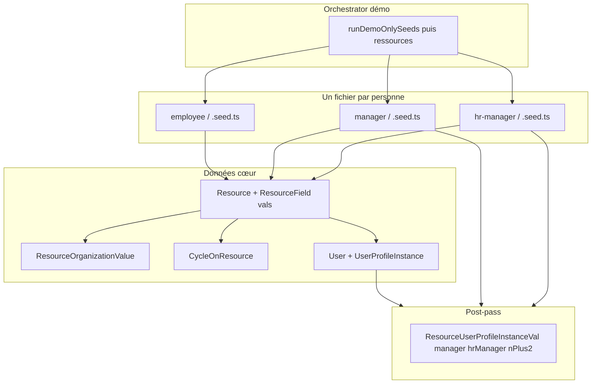

# Implémenter une nouvelle ressource (jeu démo)

Guide ciblé sur le **flux seeds démo** ([`cronexia-gta-back/app/prisma/seeds-new/25-demo`](\\wsl.localhost\Ubuntu\home\youpiwaza\code\cronexia-gta-back\app\prisma\seeds-new\25-demo)). Le jeu **dev** (`50-dev`) reste la référence pour les cas lourds (historique, pointages, déclarations, etc.) : voir notamment [`cronexia-gta-back/app/prisma/seeds-new/50-dev/resource/123456A.seed.ts`](\\wsl.localhost\Ubuntu\home\youpiwaza\code\cronexia-gta-back\app\prisma\seeds-new\50-dev\resource\123456A.seed.ts).

---

## Vue d’ensemble

Une fiche ressource exploitable côté front repose sur une **Resource**, des **valeurs de champs dynamiques** (tables typées `Resource*Val`), une **affectation organisationnelle** (`ResourceOrganizationValue`), souvent un **cycle** (`CycleOnResource`), et un **compte utilisateur** lié (`User`) avec au moins un **`UserProfileInstance`** collaborateur. Les champs **Manager / Gestionnaire RH** (type `UserProfileInstance` sur la fiche) sont alimentés **après coup** via `ResourceUserProfileInstanceVal` (voir section post-pass).

**Arborescence cible** (une ressource = un fichier, classée par rôle principal du **profil** attribué via `UserProfileInstance`) :

| Dossier | Rôle métier |
| --- | --- |
| `seeds-new/25-demo/resource/employee/` | Collaborateur (EMPLOYEE) |
| `seeds-new/25-demo/resource/manager/` | Manager (MANAGER) — souvent aussi EMPLOYEE |
| `seeds-new/25-demo/resource/hr-manager/` | Gestionnaire RH (HR_MANAGER) — souvent aussi EMPLOYEE |

**Modèle d’implémentation** : copier le boilerplate [`cronexia-gta-back/app/prisma/_bp_add_one_resource.ts`](\\wsl.localhost\Ubuntu\home\youpiwaza\code\cronexia-gta-back\app\prisma\_bp_add_one_resource.ts) vers le bon sous-dossier, renommer la fonction (`seedDemoResource_*`), renseigner les constantes en tête de fichier, brancher l’appel dans un futur orchestrator `resources.demo.seed.ts` (équivalent démo de [`cronexia-gta-back/app/prisma/seeds-new/50-dev/resource/resources.dev.seed.ts`](\\wsl.localhost\Ubuntu\home\youpiwaza\code\cronexia-gta-back\app\prisma\seeds-new\50-dev\resource\resources.dev.seed.ts)).

---

## Prérequis : dépendances injectées (`DemoResourceDependencies`)

Le type attendu par le boilerplate est défini dans [`cronexia-gta-back/app/prisma/seeds-new/25-demo/resource/interface/resource-dependencies.demo.interface.ts`](\\wsl.localhost\Ubuntu\home\youpiwaza\code\cronexia-gta-back\app\prisma\seeds-new\25-demo\resource\interface\resource-dependencies.demo.interface.ts).

| Champ | Rôle |
| --- | --- |
| `demoResourceFields` | Tous les `ResourceField` démo nécessaires, y compris une extension **company / region / area / department / activity** (voir encadré ci-dessous). |
| `resourceEnums` | Issues de `runRecommendedSeeds` (`seedResourceEnum`). |
| `resourceEnumStrVals` | Valeurs string des enums métiers (ex. `companyCronexia`, `contractCDI`, `jobDeveloppeur`, …). |
| `demoCycles` | Résultat de `seedDemoCycles` (ex. `cycleCjour` pour le template minimal). |
| `demoOrganizations` | Hiérarchie complète retournée par `seedDemoOrganizations` (`organizations`, `organizationLevels`, `organizationLevelValues`). |
| `userProfiles` | Résultat `seedUserProfiles` (`profile_EMPLOYEE`, `profile_MANAGER`, `profile_HR_MANAGER`, …). |
| `populationAllResources` | Au minimum `population_All_Resources` (`seedDemoPopulationAllResources`). |
| `demoHabilitation` | Au minimum `userAdmin_Alphonse_Eldrich` pour `User.createdById` (voir `habilitation.demo.seed.ts`). |
| `encryptedUserPassword` | Hash bcrypt **identique** à celui utilisé pour les autres comptes démo (éviter des mots de passe différents par ressource). |

**Extension des champs démo** : le jeu actuel `resource-fields.demo.seed.ts` n’expose pas encore les cinq `ResourceField` picker enum **company, region, area, department, activity**. Le type `DemoResourceFieldsForPersonSeed` les exige pour que le boilerplate compile sans cast une fois l’orchestrator branché. Il faut donc **étendre** le seed des champs démo (ou fusionner avec des ids alignés dev) avant de lancer des seeds personne en prod démo.

---

## 1. Resource (table `Resource`)

- Créer la ligne avec un **`idResource` stable** via `createSeedUuidAllocator(PREFIX_DEMO_RESOURCE)` (préfixe dans [`cronexia-gta-back/app/src/_utility/seed-uuid/prefixs.ts`](\\wsl.localhost\Ubuntu\home\youpiwaza\code\cronexia-gta-back\app\src\_utility\seed-uuid\prefixs.ts)).
- Renseigner **`matricule`** (unique) et **`socialSecurityNumber`** (unique côté métier / BDD selon contraintes).
- Conserver le `resource` retourné pour toutes les relations suivantes (`resourceId`).

---

## 2. CycleOnResource (obligatoire pour une fiche cohérente)

- Lier la ressource à un **cycle** déjà seedé (démo : `demoCycles.cycleCjour`, code `CJOUR`).
- **`effectDate`** doit rester **≥ date d’entrée** (`inDate`) ; sinon le formulaire manager / fiche peut casser (comme noté en en-tête de [`cronexia-gta-back/app/prisma/seeds-new/50-dev/resource/resources.dev.seed.ts`](\\wsl.localhost\Ubuntu\home\youpiwaza\code\cronexia-gta-back\app\prisma\seeds-new\50-dev\resource\resources.dev.seed.ts)).
- `startRank` : en général `1` pour la première affectation ; les changements historiques utilisent des lignes supplémentaires (voir `123456A`).

---

## 3. BadgeOnResource (optionnel — souvent ignoré en démo)

- Les **badges** ne sont en pratique **pas nécessaires** pour le jeu démo décrit dans le backlog actuel.
- Référence dev : `Badge` pré-seedé puis `badgeOnResource.create` / `createMany` dans `123456A` ou `0b0b_Bob_gestion_en_jours`.
- Si vous décommentez du matériel badge dans le boilerplate, gardez la cohérence `badgeId` / `historisedBadgeId` et les dates d’effet.

---

## 4. Valeurs des ResourceField (cœur métier)

Les données affichées sur la fiche passent par des tables typées selon le type du champ. Toujours renseigner **`resourceFieldId`**, **`resourceId`**, **`matriculeHelper`**, **`fieldnameHelper`**, et **`effectDate`** (souvent alignée sur `inDate` pour la première valeur).

### Liste minimale alignée fiche manager (rappel équivalent dev)

Commentaire source dans [`cronexia-gta-back/app/prisma/seeds-new/50-dev/resource/resources.dev.seed.ts`](\\wsl.localhost\Ubuntu\home\youpiwaza\code\cronexia-gta-back\app\prisma\seeds-new\50-dev\resource\resources.dev.seed.ts) (lignes 1–26) : date d’entrée, badge + affectation (optionnel démo), prénom, nom, cycle, naissance, email, entreprise, région, département, service, contrat, métier, durées journalière / hebdo, taux d’emploi, activité, modalité de gestion des temps, tickets restaurant.

### Par type de stockage

| Contexte | Modèle Prisma | Champs typiques |
| --- | --- | --- |
| Booléen | `ResourceBolVal` | `isTicketRestaurant`, … |
| Date | `ResourceDatVal` | **`inDate`**, **`birthDate`**, … — `inDate` sert de **référence** pour les autres `effectDate`. |
| Chaîne | `ResourceStrVal` | `firstName`, `lastName`, `email`, adresse, … — `value` + `historisedValue`. |
| Nombre | `ResourceNbrVal` | `employmentRatePercent`, `dailyContractWorkDurationInMinutes`, `weeklyContractWorkDurationInMinutes`, … — `value` + `historisedValue`. |
| Enum (liste) | `ResourceEnumVal` | **`company`**, **`region`**, **`area`**, **`department`**, **`activity`**, **`job`**, **`contract`**, **`resourceTimeManagementMethod`**, … — lier `resourceEnumId`, `resourceEnumStrValId` (ou `resourceEnumNbrValId` pour enums numériques), **`resourceFieldId`**, `historisedEnumValueId`. |

Le bloc **ResourceEnumVal** est le plus **sensible** (cohérence entre enum, valeur choisie, et champ dynamique). En démo on réutilise les mêmes jeux **`ResourceEnums`** / **`ResourceEnumStrVal`** que le bloc `02-recommended`.

### ResourceResourceVal / lien vers une autre Resource

- Ancien modèle « manager en Resource » (`ResourceResourceVal`) : commenté dans `123456A` au profit du modèle **UserProfileInstance**.
- Ne pas réintroduire l’ancien chemin pour les seeds modulaires neuves.

---

## 5. ResourceOrganizationValue (obligatoire — affectations organisationnelles)

Lie la ressource à une **valeur de niveau** (`OrganizationLevelValue`) dans une **organisation** donnée, avec historisation (`effectDateStart`, `effectDateEnd` optionnel).

**Référence dev** (structure + helpers) : bloc `ResourceOrganizationValue` vers la fin de [`cronexia-gta-back/app/prisma/seeds-new/50-dev/resource/123456A.seed.ts`](\\wsl.localhost\Ubuntu\home\youpiwaza\code\cronexia-gta-back\app\prisma\seeds-new\50-dev\resource\123456A.seed.ts) (Maxime → Reims, niveau Ville, org juridique).

**Référence démo** : hiérarchie seedée dans `seedDemoOrganizations` :

- **Affectation organisationnelle** : `ORG_AFF_ORGA` — niveaux **Pôle → Direction → Service → Secteur** (codes niveaux `POLE`, `DIRECTION`, `SERVICE`, `SECTEUR`).
- **Affectation juridique** : `ORG_AFF_JUR` — **Société → Établissement** (`SOCIETE`, `ETABLISSEMENT`).

Renseigner les **helpers** (`organizationCodeHelper`, `levelCodeHelper`, `valueCodeHelper`, `valueLabelHelper`, `matriculeHelper`, `fullPathHelper`) comme dans l’exemple dev pour faciliter débogage et requêtes.

Le boilerplate minimal propose **deux** lignes : une sur un pôle démo (`valDemoPole1`), une sur une société démo (`valDemoSociete1`) — à ajuster selon le scénario métier.

---

## 6. User (obligatoire pour se connecter en tant que cette ressource)

- **`login`**, **`email`**, **`password`** (hash bcrypt partagé), **`validityStart`**, **`resourceId`** vers la `Resource` créée, **`createdById`** (admin démo).
- **`idUser`** : allouer avec `PREFIX_DEMO_USER` + `createSeedUuidAllocator` (même pattern que la ressource et les UPI).

Compte tenu du choix d’implémentation **par ressource** (user créé dans le même fichier seed personne), le hash **`encryptedUserPassword`** est passé dans **`DemoResourceDependencies`** pour éviter de hasher dans chaque fichier (même approche que `seedUsers` côté dev).

---

## 7. UserProfileInstance (obligatoire — au moins EMPLOYEE)

- Un **`UserProfileInstance`** avec **`userProfileId: profile_EMPLOYEE`** relie le compte à la ressource et aux droits collaborateur.
- **`populationMotherId`** : typiquement `population_All_Resources` en démo tant qu’aucune population fine n’est définie.
- **`idUserProfileInstance`** : `PREFIX_DEMO_USER_PROFILE_INSTANCE` + allocateur.

### Rôle par sous-dossier

| Dossier | Profils à créer dans le même fichier (ou orchestration) |
| --- | --- |
| `employee/` | **EMPLOYEE** uniquement (template par défaut du boilerplate). |
| `manager/` | **EMPLOYEE** + **MANAGER** (décommenter / compléter le bloc manager du boilerplate ; populations manager à affiner quand les populations démo seront richer). |
| `hr-manager/` | **EMPLOYEE** + **HR_MANAGER**. |

Retourner les **`idUserProfileInstance`** nécessaires au **post-pass** rattachement (manager, RH, N+2, délégués).

Documentation des rôles et comptes **dev** (référence métier) :

- [`cronexia-gta-back/app/prisma/seeds/habilitation/user-roles.md`](\\wsl.localhost\Ubuntu\home\youpiwaza\code\cronexia-gta-back\app\prisma\seeds\habilitation\user-roles.md)
- [`cronexia-gta-back/app/prisma/seeds/habilitation/README.md`](\\wsl.localhost\Ubuntu\home\youpiwaza\code\cronexia-gta-back\app\prisma\seeds\habilitation\README.md)

---

## 8. Post-pass — `ResourceUserProfileInstanceVal` (manager, hrManager, nPlus2, delegue…)

Les champs fiche de type **UserProfileInstance** (`resourceFieldManagerUserProfileInstance`, `resourceFieldHrManagerUserProfileInstance`, etc.) prennent leurs valeurs dans **`ResourceUserProfileInstanceVal`**, **après** que les `UserProfileInstance` cibles existent.

Côté **dev**, c’est centralisé dans :

`cronexia-gta-back/app/prisma/seeds/habilitation/seed-resource-manager-hr-upi-vals.seed.ts`

(appelé après `seedHabilitation` dans le flux principal).

Côté **démo**, prévoir un équivalent, par exemple :

`seeds-new/25-demo/resource/resource-manager-hr-upi-vals.demo.seed.ts`

qui lit le **résultat agrégé** des seeds personne (maps `resourceId` → `idUserProfileInstance` manager / RH / …) et fait des `createMany` sur `ResourceUserProfileInstanceVal`.

Règles métier documentées dans `user-roles.md` : manager et RH **requis** sur la fiche (contraintes CFC démo/dev), N+2 et délégués **facultatifs**.

---

## 9. Orchestrator démo et ordre d’exécution

1. Tout ce qui est déjà dans [`cronexia-gta-back/app/prisma/seeds-new/25-demo/_demo-only.orchestrator.ts`](\\wsl.localhost\Ubuntu\home\youpiwaza\code\cronexia-gta-back\app\prisma\seeds-new\25-demo\_demo-only.orchestrator.ts) (champs démo, orgs, cycles, admin, population « toutes ressources », etc.).
2. **Ressources manager** (pour disposer d’UPI MANAGER référence avant les collaborateurs qui les pointent).
3. **Ressources RH** si elles servent de **HR_MANAGER** de référence.
4. **Ressources employés** (souvent en parallèle si pas de dépendances croisées).
5. **Post-pass** `ResourceUserProfileInstanceVal`.
6. Branchement dans [`cronexia-gta-back/app/prisma/seed-demo.ts`](\\wsl.localhost\Ubuntu\home\youpiwaza\code\cronexia-gta-back\app\prisma\seed-demo.ts) une fois `resources.demo.seed.ts` prêt.

Fichier d’inspiration pour l’ordre et les `otherResources` : [`cronexia-gta-back/app/prisma/seeds-new/50-dev/resource/resources.dev.seed.ts`](\\wsl.localhost\Ubuntu\home\youpiwaza\code\cronexia-gta-back\app\prisma\seeds-new\50-dev\resource\resources.dev.seed.ts).

---

## 10. Sections optionnelles (hors minimal démo)

À reprendre depuis **`123456A.seed.ts`** si le scénario l’exige :

- `ScheduleOverLoadForResource`, `ScheduleTypeOverLoadForResource`
- `EventGroupOnResourceToResource`, `EventRangeOnResource`, `EventRangeByDay`, `EventByDay`
- `Clocking`
- `Declaration`, `DeclarationDaily`

Le boilerplate ne les inclut pas ; un commentaire dans [`cronexia-gta-back/app/prisma/_bp_add_one_resource.ts`](\\wsl.localhost\Ubuntu\home\youpiwaza\code\cronexia-gta-back\app\prisma\_bp_add_one_resource.ts) renvoie vers ces blocs.

---

## Checklist avant merge

- [ ] Fichier dans `employee/`, `manager/` ou `hr-manager/` selon le **profil principal**.
- [ ] `matricule` et `socialSecurityNumber` uniques.
- [ ] UUIDs via `PREFIX_DEMO_RESOURCE` / `PREFIX_DEMO_USER` / `PREFIX_DEMO_USER_PROFILE_INSTANCE`.
- [ ] `inDate` et toutes les `effectDate` des champs obligatoires cohérents (`effectDate >= inDate` où requis).
- [ ] `ResourceEnumVal` complets pour la fiche (company … `resourceTimeManagementMethod`).
- [ ] Au moins une `ResourceOrganizationValue` **ORG_AFF_ORGA** et une **ORG_AFF_JUR** (ou variante validée métier).
- [ ] `User` + `UserProfileInstance` EMPLOYEE (+ MANAGER / HR si dossier correspondant).
- [ ] Enregistré dans le futur `resources.demo.seed.ts` + post-pass manager/RH.
- [ ] `pnpm` / seed démo + smoke tests front (fiche ressource, synthèse si concerné).

---

## Annexe — table rapide `fieldnameHelper` → table Prisma

| fieldnameHelper (exemples) | Table |
| --- | --- |
| `isTicketRestaurant` | `ResourceBolVal` |
| `inDate`, `birthDate` | `ResourceDatVal` |
| `firstName`, `lastName`, `email` | `ResourceStrVal` |
| `employmentRatePercent`, `dailyContractWorkDurationInMinutes`, `weeklyContractWorkDurationInMinutes` | `ResourceNbrVal` |
| `company`, `region`, `area`, `department`, `activity`, `job`, `contract`, `resourceTimeManagementMethod` | `ResourceEnumVal` |
| `manager`, `hrManager`, `nPlus2`, `delegue1`… | `ResourceUserProfileInstanceVal` (pas `ResourceEnumVal`) |

---

## Fichiers utiles (chemins complets)

| Fichier | Usage |
| --- | --- |
| [`.../prisma/_bp_add_one_resource.ts`](\\wsl.localhost\Ubuntu\home\youpiwaza\code\cronexia-gta-back\app\prisma\_bp_add_one_resource.ts) | Template minimal démo |
| [`.../resource-dependencies.demo.interface.ts`](\\wsl.localhost\Ubuntu\home\youpiwaza\code\cronexia-gta-back\app\prisma\seeds-new\25-demo\resource\interface\resource-dependencies.demo.interface.ts) | Contrat `deps` |
| [`.../123456A.seed.ts`](\\wsl.localhost\Ubuntu\home\youpiwaza\code\cronexia-gta-back\app\prisma\seeds-new\50-dev\resource\123456A.seed.ts) | Référence complète |
| [`.../resources.dev.seed.ts`](\\wsl.localhost\Ubuntu\home\youpiwaza\code\cronexia-gta-back\app\prisma\seeds-new\50-dev\resource\resources.dev.seed.ts) | Orchestrator dev + liste champs requis (commentaire) |
| [`.../seed-resource-manager-hr-upi-vals.seed.ts`](\\wsl.localhost\Ubuntu\home\youpiwaza\code\cronexia-gta-back\app\prisma\seeds\habilitation\seed-resource-manager-hr-upi-vals.seed.ts) | Post-pass dev manager/RH |
| [`.../habilitation/user-roles.md`](\\wsl.localhost\Ubuntu\home\youpiwaza\code\cronexia-gta-back\app\prisma\seeds\habilitation\user-roles.md) | Rôles, UPI, exceptions |
