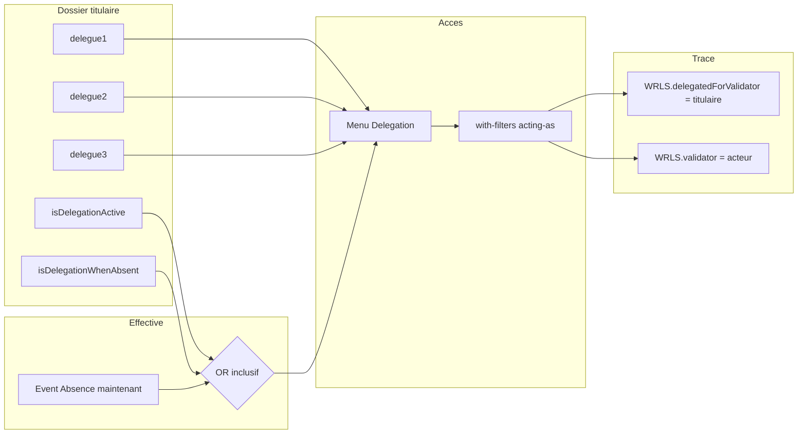
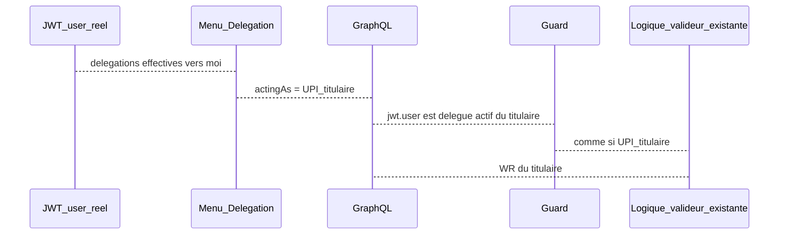

# Délégations workflow — brouillon 18/08/2026

Premier jet pour discussion (Jira / collègues). Pas d'implémentation dans ce fichier. Ticket recap : **GTA-1519**.

Patron : [260818-workflow-dynamic-tabs-plan-v2.md](260818-workflow-dynamic-tabs-plan-v2.md). Annulation (dépendance d'ordre, pas le même epic) : [260818-workflow-cancel-truth-tables.md](260818-workflow-cancel-truth-tables.md).

Objectif : qu'un validateur **titulaire** puisse désigner jusqu'à 3 délégués qui, **uniquement quand la délégation est effective**, voient et tranchent **les WR qui lui sont assignées**, y compris si le délégué a un profil plus faible (Collaborateur). Afficher ensuite **les deux identités** (acteur réel + titulaire).

---

## Décisions

- **Pas d'écran d'admin dédié.** Assignation déjà gérée dans le dossier ressource `employee-file` (onglet seedé **Délégués** : `delegue1` / `delegue2` / `delegue3`). On **réutilise** ces 3 RF. Cap 3 = produit / seeds, pas une nouvelle table.
- **Activation = OU inclusif de deux RF Boolean** historisés sur le dossier du titulaire (deux **instances** de champ, pas un auto-flip). Défaut métier des deux = **false**. Délégation **effective** ssi :

```text
isDelegationActive === true
  OR (
    isDelegationWhenAbsent === true
    AND la resource du titulaire a un Event d'absence qui couvre maintenant
  )
```

  Remplir `delegue*` sans l'un de ces deux chemins **n'active rien**. Les absences **n'écrivent pas** les Booleans.
- **Titulaire et délégués en parallèle** tant que la délégation est **effective**. Premier arrivé gagne (WRLS/WR encore `pending`, mêmes no-op / erreurs qu'aujourd'hui).
- **Anti self-délégation :** flag `ResourceField.excludeSelf` (générique, type UPI) + UX InputUPI (soi **affiché mais disabled**) + **guard back**. Seed `true` sur `delegue1/2/3`.
- **Périmètre droits v1 :** seulement **Gestion des demandes** (`/request-management`) + valider/refuser les WR du titulaire. Pas le dossier, pas le planning, pas les autres pages Manager. L'accordéon d'une WR peut déjà embarquer horaires / events / pointages : **même payload qu'aujourd'hui** ; les droits plus fins absents du code restent des `// TODO: Implement later when XXX right is implemented`.
- **Entrée délégué :** nouveau menu **Délégation**, sous-menu = pages autorisées (v1 : Gestion des demandes). Sur ces pages uniquement, le collaborateur **hérite de l'UPI du titulaire** (rôle, rang, populations, `canAccessAttachments`, outrepassement). JWT reste l'utilisateur réel — on n'impersonne pas le token.
- **Pages Délégation = `(with-filters)/`.** Le bandeau (population / resource / période) est **inconditionnel**, y compris pour un délégué EMPLOYEE. Pas de route Délégation sous `(without-filters)` ni `/demands`.
- **Si plusieurs titulaires :** une entrée de sous-menu par titulaire, puis la page. Un Manager déjà valideur **garde** son inbox perso **et** le menu Délégation (deux files distinctes).
- **Pas de délégation transitive.** A délègue à B : les délégués de B ne voient pas les WR de A.
- **Notifications (table `Notification`, pas toasts) :** si la délégation est **effective**, les délégués reçoivent **aussi** les notifs du titulaire. Le titulaire continue de les recevoir. Expéditeur d'une action déléguée = acteur JWT.
- Contraintes métier inchangées (commentaire obligatoire si refus, gel annulation, cascade, etc.).



---

## État actuel (à ne pas casser)

Résolution validateur aujourd'hui (**pas** les délégués) :

| Couche | Comportement |
| --- | --- |
| `WorkflowLevel` | Rôle (`userProfileId`) + RF sur le **demandeur** (`manager` / `hrManager`) |
| RUPIV | Latest `effectDate <= now()` = UPI titulaire |
| Liste | `userProfileInstanceGetWorkflowResource` |
| Action | `userProfileInstanceUpdateWrlsStatusWithCascade` + `guardUpiCanValidateWrls` |
| Front `/request-management` | Gate profil `MANAGER \| HR_MANAGER \| ADMIN \| SUPER_ADMIN` **en plus** de `PAGE_DEMANDS` |
| Timeline | Une personne par niveau (`level.validator`) |
| Enum UI `ValidatedFromDelegation` | Existe, recollé à « Validée » |

- TODO existant : `// Suppléants / délégués — réintroduire quand le modèle sera stabilisé` dans `cronexia-gta-back/app/src/user-profile-instances/functions/workflow-resource/functions/guard-upi-can-validate-wrls.ts`. Specs validated/refused : délégués **hors périmètre**. Le **runtime** n'est pas branché ; les **données de recette** (au moins un délégué par titulaire) sont uniquement en **Seeds / recette** + Backend-02 — pas ici.
- Auth GraphQL de ces endpoints **commentée** (tests). Ce chantier **doit** distinguer JWT réel vs UPI héritée — réactiver le JWT sur query/mutation validateur (droits API seedés : point ouvert, pas blocker du modèle).
- Les 3 RF `delegue*` n'ont **pas** de `userProfileId` (contrairement à `manager`) : le picker accepte n'importe quelle UPI, y compris EMPLOYEE. C'est voulu pour les droits inférieurs.

Fichiers d'accroche :

- `cronexia-gta-back/app/prisma/schema/workflow-level.prisma`
- `cronexia-gta-back/app/prisma/schema/workflow-resource.prisma`
- `cronexia-gta-back/app/prisma/schema/workflow-resource-level-state.prisma`
- `cronexia-gta-back/app/src/user-profile-instances/functions/workflow-resource/`
- Front : `cronexia-gta-front-v2/app/src/routes/(app)/(with-filters)/request-management`
- Dossier : `cronexia-gta-front-v2/app/src/routes/(app)/(with-filters)/employee-file`

---

## Modèle de données

### Déjà là — ne pas recréer

- `delegue1` / `delegue2` / `delegue3` : type `UserProfileInstance`, historisés, onglet **Délégués**, valeurs dans `ResourceUserProfileInstanceVal` **sur la resource du titulaire** (pas sur chaque collaborateur de l'équipe).
- `InputUserProfileInstance` a déjà `excludeMatricule` : aujourd'hui `AllFieldsLoop.svelte` **retire** la resource courante de la liste pour **tous** les champs UPI. Ce n'est **pas** le contrat cible (soi visible + disabled, flag par RF).
- **Qui a quel délégué en recette** : une seule liste, section **Seeds / recette** (Backend-02). Pas de noms ici.

### Deux RF Boolean (seeds, pas de table `Delegation`)

Deux **instances** `ResourceField` type `Boolean`, historisées, `isCustom: false`, CFC `isRequired: false`, défaut = pas de `ResourceBolVal` ou valeur `false`. Même onglet **Délégués**. Field-lock (back `field-lock-overrides.ts` + front `resource-field-constraints.config.ts`) : même patron que `delegue1/2/3`.

| position | name | label FR proposé | Rôle |
| --- | --- | --- | --- |
| 0 | `isDelegationActive` | Délégation activée | **Toujours on** si true (indépendant des absences) |
| 1 | `isDelegationWhenAbsent` | Délégation si absent | **Ne suffit pas seul** : il faut **aussi** un Event d'absence **en cours** sur la resource du titulaire |
| 2 | `delegue1` | Délégué 1 | déjà seedé |
| 3 | `delegue2` | Délégué 2 | déjà seedé |
| 4 | `delegue3` | Délégué 3 | déjà seedé |

**Pas de ticket UI dossier** pour les switches : le renderer générique d'`employee-file` les affiche une fois seedés.

#### Règle `isDelegationEffective(titulaireResource, now)`

À évaluer côté back (menu, guard query, guard mutation) — **pas** un 3e champ stocké.

1. Latest `ResourceBolVal` de `isDelegationActive` (`effectDate <= now`) = true → **effective**.
2. Sinon latest `isDelegationWhenAbsent` = true **et** existence d'un `EventRangeOnResource` sur cette resource avec `event.type === Absence` et `dateStart <= now <= dateEnd` → **effective**.
3. Sinon **inactive** (menu masqué, acting-as refusé).

Les deux Booleans peuvent être true ensemble (OU inclusif : la première clause gagne, toujours on).

Point ouvert (ne bloque pas le split) : absences **pending** (WR pas encore validée) vs seulement Event déjà posé / WR `validated` ; granularité AM/PM (`typeDayStart` / `typeDayEnd`) vs jour calendaire ; maladies vs tout `EventTypeEnum.Absence`.

### ResourceField `excludeSelf` (nouveau champ Prisma)

Sur `cronexia-gta-back/app/prisma/schema/resource-field.prisma` :

- `excludeSelf Boolean @default(false)` — sémantique **uniquement** si `type === UserProfileInstance` (ignoré sinon).
- **true** : dans InputUPI, les UPI dont `user.resource` = resource du dossier édité restent **visibles** mais **disabled** (pas de select). Guard back refuse l'écriture RUPIV si l'UPI choisie appartient à la même resource.
- Seed `excludeSelf: true` sur `delegue1` / `delegue2` / `delegue3`.
- « Soi » = **resource du dossier**, pas l'utilisateur connecté (un RH qui édite Murielle désactive les UPI de **Murielle**).

Pas un CFC. Toggle admin `/admin/fields` : in scope léger (type UPI seulement) pour ne pas laisser le flag uniquement seed-only ; sinon lock + seed suffisent en v1 (point ouvert).

### Trace acteur vs titulaire (migration Prisma)

Aujourd'hui `WRLS.validatorId` / `WR.lastValidatorId` = l'UPI qui a **agi**. Les commentaires Prisma mentionnent déjà « principal, délégué ou niveau supérieur » mais **un seul** slot.

Ajouter (nullable, `onDelete: SetNull`) :

| Modèle | FK | Helper |
| --- | --- | --- |
| `WorkflowResourceLevelState` | `delegatedForValidator` / `delegatedForValidatorId` | `delegatedForValidatorHelper` |
| `WorkflowResource` | `lastDelegatedForValidator` / `lastDelegatedForValidatorId` | `lastDelegatedForValidatorHelper` |

Même format de helper que `validatorHelper` / `lastValidatorHelper`. Index Brin sur les FKs (même style que `validatorId`).

Règles d'écriture :

| Action | `validatorId` / helper | `delegatedFor*` |
| --- | --- | --- |
| Titulaire (pas de délégation) | acteur = titulaire | **null** |
| Délégué | **UPI réelle du JWT** (souvent EMPLOYEE) | **UPI titulaire héritée** |
| Cascade (outrepassement, rangs inférieurs) | **même paire** sur tous les WRLS patchés | idem |

- `state` métier inchangé (`validated` / `refused`). **Pas d'obligation** d'ajouter `validatedByDelegation` dans `WorkflowDebugStateEnum` : la FK est la source de vérité. Front mappe déjà `ValidatedFromDelegation` — le brancher sur `delegatedForValidatorId != null`. Option recette : `stateDebug` dédié = point ouvert, pas blocker.
- Hériter l'UPI titulaire sert à **autoriser et lister**. Ça ne doit **pas** être écrit dans `validatorId` (sinon la timeline ment).

---

## Contrat d'accès (menu + JWT + UPI)



- Query menu : titulaires pour lesquels **au moins un** `delegue*` current pointe vers **une UPI du user JWT** (match **par user / resource du délégué**, pas seulement l'UPI sélectionnée — un Collab en profil EMPLOYEE doit matcher même si le picker a stocké une autre UPI de la même personne) **et** `isDelegationEffective(...)`.
- Auto-délégation (picker = soi-même) : **refusée** (InputUPI disabled + guard RUPIV). Même si un client bypasse le front.
- Pages sous Délégation : passer `actingAsUserProfileInstanceId` (titulaire). Le `userProfileInstance` des APIs existantes peut rester l'UPI héritée **à condition** que le guard vérifie le JWT **et** que la délégation soit encore effective **au moment de l'action** (une absence qui se termine retire l'accès `isDelegationWhenAbsent` sans attendre un refresh de flag).
- Gate layout `/request-management` actuelle (codes profil valideur) : **ne s'applique pas** (ou s'applique via acting-as) aux URLs Délégation. `PAGE_DEMANDS` suffit (déjà sur EMPLOYEE).
- **Groupe de routes :** `(with-filters)/` **obligatoire** (bandeau inconditionnel, y compris délégué EMPLOYEE). Pas `(without-filters)`, pas `/demands`.
- URI exacte **à l'intérieur** de with-filters (point ouvert, pas blocker modèle) : préfixe `/delegation/[[titulaire]]/request-management/...` **ou** réutiliser `/request-management` + contexte acting-as (cookie / layout). Préférence à discuter : **préfixe bookmarkable**, shell `ValidatorDemandsTabShell` **réutilisé** (ne pas dupliquer tables / cascade). GTA-1521 change `[[name]]` : **aligner l'URI Délégation après** ce contrat, ou isoler un wrapper.

---

## Implications métier (garder le comportement titulaire)

| Sujet | Règle v1 |
| --- | --- |
| Outrepassement | Acting-as UPI HR **doit** permettre l'override rang 1, **uniquement** sur les WR de l'équipe du titulaire. Commentaire obligatoire dans le guard : `// TODO: Later : un délégué hérite des droits d'outrepassement éventuels (délégation d'un Gestionnaire RH)` — empêche qu'un 1er slice same-rank l'oublie |
| PJ | `WorkflowLevel.canAccessAttachments` du niveau visé par l'UPI héritée (Manager rang 1 = pas les PJ CMAR ; HR = oui) |
| Populations / bandeau | Bandeau **with-filters toujours monté**. Scope données = **titulaire**, pas le Collab |
| Annulation (GTA-1491) | Même guard ; un délégué peut trancher un WR enfant d'annulation du titulaire. Gel parent inchangé. Si cancel merge avant, réutiliser le guard étendu |
| Commentaire refus / alertes déclaratifs | Inchangé (déjà serveur) |

**Notifications (table `Notification`, pas toasts) :**

- Si délégation **effective** : **titulaire + délégués** reçoivent les lignes (fan-out). Pas de toast dédié.
- Expéditeur d'une action déléguée = **acteur réel** (JWT).
- Notif collab : libellé « par X pour Y » vs nom de l'acteur seul — point ouvert UX.

**Widget home / AI / batch :** voir Frontend-07. Défaut : **OOS du 1er slice** (ou ticket FE séparé après Frontend-04).

---

## Seeds / recette

- Seed des 2 RF Boolean + CFC + places onglet + locks + `excludeSelf: true` sur les 3 `delegue*`.
- Scénarios WR 21/22 (GTA-1651) : traces acteur + titulaire seedées (`delegatedForValidatorId` / `lastDelegatedForValidatorId`). Délégation effective + acting-as API = GTA-1652 / GTA-1655 / GTA-1656.

**Au moins un `delegue*` par titulaire recette** (Backend-02 ; pas d'inventaire des `.seed.ts`). Murielle / Pierre-Olivier ont déjà des RUPIV partiels ; **Maxime Manager** est le trou à combler.

| Titulaire | Rôle | Contrat recette |
| --- | --- | --- |
| Maxime Manager | MANAGER | au moins un `delegue*` (trou actuel) |
| Murielle Manager | MANAGER | au moins un `delegue*` (déjà partiel) |
| Pierre-Olivier Courtois | Gestionnaire RH | au moins un `delegue*` (déjà partiel) |

| # | Titulaire | `isDelegationActive` | `isDelegationWhenAbsent` | Absence now | Menu Délégation | Note |
| --- | --- | --- | --- | --- | --- | --- |
| S1 | Murielle | true | false | non | **présent** | Toujours on, sans absence |
| S2 | (à seed) | false | true | **oui** | **présent** | Chemin absence |
| S3 | même que S2 | false | true | non / hors plage | **absent** | Flag seul ne suffit pas |
| S4 | (à seed) | false | false | indifférent | **absent** | Même si `delegue*` rempli |
| S5 | — | — | — | — | — | `delegue*` vers UPI **EMPLOYEE** (droits inférieurs) |
| S6 | — | — | — | — | — | Titulaire **et** délégué voient la même WR ; après action de l'un, no-op / disparition file pour l'autre |
| S7 | — | — | — | — | — | RUPIV `delegue1 = soi` → **erreur API** |

---

## Tickets Jira (par développeur)

Ordre de dépendance. OOS = Out of Scope. **Pas** d'admin organize/manage. Recap parent : **GTA-1519**.

Copier le titre + la phrase recap non-dev + bullets dans chaque ticket enfant. **Frontend-04 ne part pas** tant que Backend-08 n'a pas livré builders GraphQL + routes `/api`. Frontend-03 / Frontend-05 dépendent aussi de Backend-08 (plus de tickets Frontend-01 / Frontend-02). Frontend-06 InputUPI peut partir dès Backend-01 (`excludeSelf` en schéma + seed).

---

### Backend-01 — Prisma : trace acteur / titulaire + `excludeSelf`

Persister qui a vraiment agi vs pour qui, et empêcher de se choisir soi-même comme délégué au niveau champ.

**In scope.** Migration uniquement. Dépend de : —.

- FKs + helpers + index Brin sur `delegatedForValidatorId` / `lastDelegatedForValidatorId` (même style que `validatorId`)
- Relations inverses sur `UserProfileInstance`
- `ResourceField.excludeSelf Boolean @default(false)`
- `prisma migrate` + generate. Pas de module Nest

**Fichiers :** `workflow-resource.prisma`, `workflow-resource-level-state.prisma`, `resource-field.prisma`, relations `UserProfileInstance`

---

### Backend-02 — Seeds 2 RF Boolean + `excludeSelf` + jeux délégation

Données de recette (flags, 3 titulaires avec au moins un délégué, cas absence / collab).

**In scope.** Dépend de Backend-01 pour les WR de recette qui écrivent les FKs ; les RF Boolean peuvent partir en parallèle du 01 si les WR recette sont un sous-ticket.

- `isDelegationActive` + `isDelegationWhenAbsent` + CFC + onglet Délégués (ordre : 2 Booleans puis 3 pickers) + locks
- `excludeSelf: true` sur `delegue1/2/3`
- Au moins un `delegue*` sur **Maxime Manager**, **Murielle Manager**, **Pierre-Olivier Courtois Gestionnaire RH** (Maxime Manager = trou à combler ; pas d'inventaire des `.seed.ts`)
- BolVal (matrices S1–S4) + RUPIV délégué EMPLOYEE (S5) + au moins un Event absence recette
- Scénarios 21/22 : traces FK déjà seedées (GTA-1651). Ce ticket = flags RF + délégués effectifs pour que l’API acting-as puisse les utiliser.

**Fichiers :** `resource-fields.dev.seed.ts` (+ demo), CFC, tabs, `field-lock-overrides.ts`, habilitation RUPIV

---

### Backend-03 — Helper résolution délégations

Savoir si une délégation est active et pour qui, sans encore exposer d'API.

**In scope.** Pas de GraphQL encore, fonctions pures testables. Dépend de : RF existants + EventRange.

- `isDelegationEffective(titulaireResourceId, now)` — formule OU inclusif (BolVal + `EventRangeOnResource` type Absence)
- `resolveActiveDelegationsForUser(jwtUserId)` → titulaires (UPI + resource + label) **seulement si effective**
- `assertUserIsActiveDelegateOf(jwtUserId, titulaireUpiId)` — refuse si plus effective (ex. fin d'absence)
- Match délégué **par user/resource**
- Interdits : soi-même, pas effective, `delegue*` vide, transitivité

**Fichiers :** `cronexia-gta-back/app/src/user-profile-instances/functions/workflow-resource/`. Helper absence près des queries EventRange existantes.

---

### Backend-03b — Guard écriture RUPIV `excludeSelf`

Refuser en base qu'on se désigne soi-même délégué.

**In scope.** Dépend de Backend-01.

- Create/update `ResourceUserProfileInstanceVal` : si le RF a `excludeSelf === true` et l'UPI cible appartient à la **même resource** que `resourceId` de la valeur → `BadRequestException` Cronexia
- Indépendant du JWT éditeur (RH qui pose Murielle sur Murielle = refusé pareil)

---

### Backend-04 — Query liste WR en acting-as

Un délégué voit la même file de demandes que le titulaire.

**In scope.** Dépend de Backend-03. **Bloque Frontend-04.**

- `userProfileInstanceGetWorkflowResource` : si `actingAs` (ou UPI args = titulaire) + JWT délégué actif → **réutiliser** la résolution RUPIV **du titulaire** (ne pas inventer un 2e algorithme)
- JWT obligatoire : l'appelant possède l'UPI **ou** est délégué actif
- Réponse : WR identiques au titulaire (rangs, `includeLowerValidationLevels`, badges)
- Champs virtuels `resourceCurrentValidator*` restent le **titulaire attendu** (RUPIV demandeur), pas le délégué

---

### Backend-05 — Mutation cascade + écriture paire

Un délégué peut valider/refuser au nom du titulaire, avec trace des deux identités.

**In scope.** Dépend de Backend-03 + Backend-01. **Bloque Frontend-04.** Guard : `guard-upi-can-validate-wrls.ts` + apply validated/refused.

- Autoriser comme titulaire ; écrire `validator*` = UPI JWT ; `delegatedFor*` = titulaire si acting-as, sinon null
- Helper acteur = `deriveUserProfileInstanceHelperOrThrow` sur l'UPI JWT ; helper titulaire idem sur UPI héritée
- Commentaire refus inchangé
- Specs markdown validated/refused : sortir « délégués » du hors-périmètre
- Commentaire obligatoire dans le guard : `// TODO: Later : un délégué hérite des droits d'outrepassement éventuels (délégation d'un Gestionnaire RH)` — acting-as UPI HR **doit** permettre l'override rang 1

---

### Backend-06 — GraphQL surface lecture + menu

API lecture (menu « mes délégations actives » + champs trace).

**In scope.** Dépend de Backend-01 + Backend-03. **Bloque Backend-08.**

- Exposer `delegatedForValidator { user { resource { firstName lastName } } }` (+ helpers) sur WRLS et WR (`lastDelegatedFor*`)
- Query `myActiveDelegations` (nom TBD) pour le menu : id UPI titulaire, nom, matricule, photo, rôle — filtrée par `isDelegationEffective`
- Exposer `excludeSelf` sur le modèle GraphQL `ResourceField` (dossier + admin fields)
- Module déjà `UserProfileInstances` — pas forcément un nouveau module

---

### Backend-07 — Notifications

Evolution des notifications afin qu'elles soient également envoyées aux délégués, si la délégation est activée par le User de référence.

**In scope.** Dépend de Backend-05. `create-workflow-notification.ts` / `resolveValidatorUpiId`.

- Contrat : délégation **effective** → fan-out table `Notification` vers **titulaire + délégués**. **Pas** de toasts.
- `forwarded_to_validator` (et autres kinds validateur) : mêmes destinataires délégués si `isDelegationEffective` au moment de la notif
- Copy collab si on affiche « pour Y »
- `// TODO: Implement later when XXX right is implemented` si d'autres canaux (mail, etc.)

---

### Backend-08 — Builders GraphQL front + routes `/api`

Brancher le front (queries GraphQL + routes `/api`) pour que le menu et les pages puissent consommer le back.

**In scope.** Lane **Backend**. Dépend de Backend-06. **Bloque Frontend-03, Frontend-04, Frontend-05.** Anciens Frontend-01 / Frontend-02, faits par le back pour accélérer.

- Patron user-profile-instance. Regen codegen après Backend-06
- Query `myActiveDelegations`
- Étendre `userProfileInstanceGetWorkflowResource` + mutation result : `delegatedForValidator*`
- Param `actingAs` / UPI titulaire sur les appels existants
- Miroir `workflow-resource-to-validate` + `update-wrls-status-with-cascade` : propager acting-as
- `GET /api/user-profile-instance/my-active-delegations`

**Frontend-03 ne démarre pas** sans ce ticket (ou fixtures au shape de `myActiveDelegations`).

---

### Backend-09 — Tests unitaires

Filet de tests (cas flags, absence, self, acting-as).

**Inclus dans les tickets de dev** (comme onglets), pas un epic séparé OOS. Cas à coller dans Backend-03 / 03b / 04 / 05 :

- Les deux flags off
- `isDelegationActive` seul
- `isDelegationWhenAbsent` + absence / sans absence
- Parallèle titulaire + délégué
- EMPLOYEE délégué
- Override HR délégué (`TODO: Later` outrepassement)
- Self RUPIV
- JWT ≠ acting-as
- Refuse sans commentaire
- Fin d'absence retire l'acting-as

---

### Frontend-03 — Menu Délégation

Menu Délégation vers les pages with-filters.

**Dépend de Backend-08.**

- Visible ssi `myActiveDelegations.length > 0` (tous profils, y compris EMPLOYEE)
- Hrefs **uniquement** sous `(with-filters)/` (bandeau inconditionnel). Pas `/demands`, pas without-filters
- 1 titulaire : Délégation → Gestion des demandes (base with-filters)
- N titulaires : Délégation → {Nom titulaire} → Gestion des demandes
- **Ne pas** ajouter d'autres enfants en v1. Commentaire `// TODO: Implement later when XXX right is implemented` (dossier, planning, anomalies, widgets hors RM, etc.)

**Fichiers :** `links-by-profile/employee.ts` **et** manager/hr (un Manager délégué d'un RH voit aussi le menu). `page-links.svelte.ts`.

---

### Frontend-04 — Shell request-management en acting-as

Pages acting-as avec bandeau, même shell que la gestion des demandes.

**In scope.** Dépend de Frontend-03 + Backend-04 + Backend-05 + Backend-08. Réutiliser `ValidatorDemandsTabShell` / loaders.

- Route **dans** `(with-filters)/` : bandeau population / resource / période **toujours monté** (y compris délégué EMPLOYEE)
- Contexte titulaire (layout) : tous les fetch WR + mutations passent l'UPI héritée ; scope données bandeau = titulaire
- Bypass du redirect profil dans `request-management/+layout.server.ts` **uniquement** en contexte Délégation
- Badges onglets = file du titulaire
- Pastille UI « Délégation pour {titulaire} » pour ne pas confondre avec l'inbox perso d'un Manager
- Alignement URI avec GTA-1521 (onglets `[[name]]`) : même wrapper, pas un 2e arbre de tabs
- `// TODO: Later : un délégué hérite des droits d'outrepassement éventuels (délégation d'un Gestionnaire RH)` si les CTA same-rank sortent avant l'override

---

### Frontend-05 — Timeline / mapping acteur + titulaire

Timeline « par X pour Y ».

**Dépend de Backend-06 + Backend-08.**

- `WorkflowDemandTimeline.svelte` : si `delegatedForValidator` → deux identités (ex. « Validée par {acteur} pour {titulaire} ») ; sinon inchangé
- Brancher `ValidatedFromDelegation` (aujourd'hui recollé à « Validée ») sur la FK
- `map-validator-for-workflow-level-state.ts` : pending = titulaire RUPIV ; tranché = acteur + delegatedFor
- Surfaces absences `AbsenceLastValidator` / `lastValidator` : si last action déléguée, même double identité (petit écart, in scope si le composant lit déjà WR)

---

### Frontend-06 — Employee-file Booleans + InputUPI exclude-self

Dossier (2 switches + picker soi disabled).

**Pas une page nouvelle** pour l'assignation. Dépend de Backend-01 + Backend-02.

- Vérifier que `isDelegationActive` et `isDelegationWhenAbsent` se rendent (switch historisé) sur l'onglet Délégués
- `InputUserProfileInstance.svelte` : si `resourceField.excludeSelf` → options de la resource courante **listées, disabled**. Conserver `excludeMatricule` pour les champs qui veulent encore **cacher** (manager / hrManager : ne pas changer leur UX sauf décision contraire)
- `AllFieldsLoop.svelte` : passer `excludeSelf={resourceField.excludeSelf}` ; ne plus forcer `excludeMatricule` sur `delegue*` si `excludeSelf` est true
- GraphQL resource-field : exposer `excludeSelf` au front (si pas déjà dans le gather dossier)
- Option : toggle `excludeSelf` dans `/admin/fields` pour type UPI (léger). Sinon seed + lock

---

### Frontend-07 — Widget + AI (slice 2 ou OOS)

Widget / IA (slice 2).

- `WidgetValidationDemandes.svelte` : WR déléguées vs inbox perso
- AI `AiPathDemandValidate` : acting-as
- Défaut proposé : **OOS du 1er sprint** si charge ; sinon ticket FE séparé après Frontend-04

---

## Tableau de split

| Ticket | Lane | Dépend de |
| --- | --- | --- |
| Backend-01 schéma trace + `excludeSelf` | Backend | — |
| Backend-02 seeds 2 Booleans + recette | Backend | Backend-01 pour WR post-action |
| Backend-03 helpers `isDelegationEffective` | Backend | RF + EventRange |
| Backend-03b guard RUPIV self | Backend | Backend-01 |
| Backend-04 query WR acting-as | Backend | Backend-03 |
| Backend-05 mutation + guard | Backend | Backend-03, Backend-01 |
| Backend-06 GraphQL menu + fields | Backend | Backend-01, Backend-03 |
| Backend-07 notifications | Backend | Backend-05 |
| Backend-08 graphql + `/api` front | Backend | Backend-06 |
| Backend-09 tests | Backend | tickets de dev concernés (pas OOS du chantier) |
| Frontend-03 menu Délégation | Frontend | Backend-08 |
| Frontend-04 shell acting-as | Frontend | Frontend-03, Backend-04, Backend-05, Backend-08 |
| Frontend-05 timeline double identité | Frontend | Backend-08, Backend-06 |
| Frontend-06 dossier 2 Booleans + InputUPI | Frontend | Backend-01, Backend-02 |
| Frontend-07 widget / AI | Frontend | **OOS ou slice 2** |

---

## Points ouverts (discussion, ne bloquent pas le découpage)

- Labels FR exacts des 2 Booleans (`isDelegationActive` / `isDelegationWhenAbsent`)
- Quelles absences comptent pour `isDelegationWhenAbsent` : tout `EventTypeEnum.Absence` déjà posé sur la resource ; seulement WR `validated` ; CP **pending** (demande pas encore tranchée) ; maladies ; AM/PM vs jour entier
- Toggle admin `/admin/fields` pour `excludeSelf` vs seed + lock seulement
- Manager / hrManager : garder `excludeMatricule` (caché) ou passer au même disabled
- URI Délégation **dans** `(with-filters)/` : préfixe `/delegation/[[titulaire]]` vs reuse `/request-management` + acting-as (hors with-filters = **fermé**)
- Match picker : user/resource (proposé) vs UPI stricte stockée dans `delegue*`
- `stateDebug` `validatedByDelegation` / `refusedByDelegation` vs FK seule
- Copy notif collab et libellé timeline (FR exact)
- Qui a le **droit d'édition** des 3 délégués + 2 Booleans (déjà `visibleTo: by user` + droits RF dossier) — pas un nouvel écran, juste confirmer RH vs titulaire lui-même
- Widget / AI dans le 1er slice
- Réactiver `GqlJwtAuthGuard` + seed `API_USER_PROFILE_INSTANCE_*` : **recommandé dans cet epic** (sécurité acting-as) ; si trop gros, ticket bloquant collé
- GTA-1521 (onglets dynamiques) vs URI Délégation : ne pas forker les tabs
- Chaîne A→B→C plus tard
- Cap 3 vs table N plus tard

---

## OOS

- Admin manage/organize, CRUD RF, nouvel écran « gestion des délégations »
- Impersonation JWT / switch-profile vers l'UPI titulaire
- Héritage des pages Manager hors request-management (dossier, planning, anomalies, compteurs…)
- Table Prisma `Delegation` (période début/fin dédiée, N délégués). La période = historisation RF (`effectDate`) comme le reste du dossier. L'absence n'écrit **pas** les Booleans
- Transitivité
- Rewiring widgets / AI **sauf** si Frontend-07 est tiré dans le sprint
- i18n labels BDD

---

## Droits accordéon / payloads (rappel)

v1 = le délégué voit **ce que la query WR du titulaire renvoie déjà** dans request-management. Si plus tard clockings / schedules / employee-file sont protégés par des droits dédiés sur ces surfaces :

```text
// TODO: Implement later when PAGE_CLOCKINGS (or API_*) right is implemented for delegation scope
```

Ne pas ouvrir `/clockings` ni `/employee-file` via le menu Délégation en v1.
